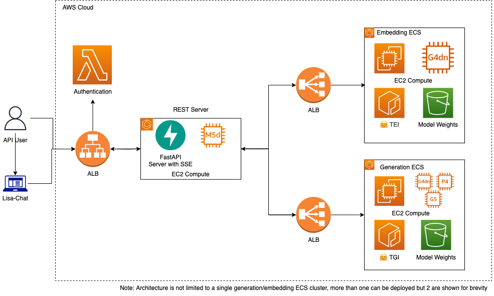

# LLM inference solution for Amazon Dedicated Cloud (LISA)

LISA is an enabling service to easily deploy generative AI applications in AWS customer environments. LISA is an infrastructure-as-code solution. It allows customers to provision their own infrastructure within an AWS account. Customers then bring their own models to LISA for hosting and inference.
LISA accelerates the use of generative AI applications by providing scalable, low latency access to customers’ generative LLMs and embedding language models. Using LISA to support hosting and inference allows customers to focus on experimenting with LLMs and developing generative AI applications. LISA includes an example chatbot user interface that customers can use to experiment. Also included are retrieval augmented generation (RAG) integrations with Amazon OpenSearch and PGVector. This capability allows customers to bring specialized data to LISA for incorporation into the LLM responses without requiring the model to be retrained.



## Table of contents

- [Background](#background)
- [Get Started](#get-started)
  - [Define Environment Variables](#define-environment-variables)
  - [Setting Up Your Environment](#setup-up-your-environment)
  - [Staging Model Weights](#staging-model-weights)
  - [Customize Configuration](#customize-configuration)
  - [Bootstrap](#bootstrap)
  - [Deploy](#deploy)
- [Model Compatibility](#model-compatibility)
- [Load Testing](#load-testing)
- [Chatbot Example](#chatbot-example)

## Background

LISA was inspired by another AWS open source project [aws-genai-llm-chatbot](https://github.com/aws-samples/aws-genai-llm-chatbot) and deploys LLMs using the [text-generation-inference](https://github.com/huggingface/text-generation-inference/tree/main) container from HuggingFace. LISA is different from it's inspiration in a few ways:

1.  LISA is designed to operate in Amazon Dedicated Cloud (ADC) partitions.
2.  LISA is designed to be composable so we've separated the the underlying LLM serving capability, this repository contains, LISA-Serve and the chat frontend, LISA-Chat, which are deployable as separate stacks.

## Getting Started

LISA leverages AWS's cloud development toolkit (cdk). Users of LISA should be familiar with CDK and infrastructure-as-code principles. If CDK is new to you please see the [documentation on CDK](https://docs.aws.amazon.com/cdk/v2/guide/getting_started.html) and talk to your AWS support team to help get you started.

LISA uses a `make` system that leverages both environment variables and a configuration file. Most of the commands to deploy LISA are wrapped in high level `make` actions, please see [Makefile](./Makefile).

Let's start by downloading the repository:

```
git clone <path-to-lisa-repo>
cd lisa
```

### Define Environment Variables

As we stated earlier you will need to define some parameters in environment though most parameters are provided by the example configuration file, [example_config.yaml](./examle_config.yaml). You'll need to create a copy of that file and name it `config.yaml`. Any deployment specific values should be set in the `config.yaml` file which will be used when running the make commands.

```bash
# you can also leave this blank
export PROFILE=my-aws-profile
# this will prepend the stack name in cloud formation
export DEPLOYMENT_NAME=my-deployment
# the type of deployment likely dev, test or prod
export ENV=dev
```

### Setting Up Your Environment

LISA uses both Python and TypeScript so we need to setup these environments first. These are one time operations and do not need to be repeated each time LISA is deployed from the same developer machine/account. Let's first install Python requirements:

```bash
# required for parsing the Makefile
sudo apt-get install jq
pip3 install yq huggingface_hub s5cmd
make createPythonEnvironment
activate your python environment (command required is output from the previous make command)
make installPythonRequirements
```

Next we can setup the typescript environment.

```bash
make createTypeScriptEnvironment
make installTypeScriptRequirements
```

### Staging Model Weights

All model weights are stored in S3. LISA was built to use your account's S3 bucket and not publicly available model repositories. Here we assume that the s3 bucket is formatted as follows:

```
s3://<bucket-name>/<hf-model-id-1>
s3://<bucket-name>/<hf-model-id-1>/<file-1>
s3://<bucket-name>/<hf-model-id-1>/<file-2>
...
s3://<bucket-name>/<hf-model-id-2>
```

We also will need `.safetensors`. In order to reduce the startup time we will do this ahead of time. A check is run at deploy time to ensure all models have safetensors. You will be provided with the opportunity to convert models without safetensors. Model download and conversion occurs locally, so make sure you have a sufficient space on your disk. On internet connected systems, models will be downloaded via HuggingFace using the provided HuggingFace model ID. On airgapped systems, we expect model artifacts to be downloaded locally and placed in a `models` directory in the project root. Models should be placed in HuggingFace format like `models/<model-id>` where `model-id` is the `/` delimited string `<model org>/<model name>` matching the model card on HuggingFace's model repo.

Note: we have primarily designed and tested this with HuggingFace models in mind. Any models outside of this format will require you to create and upload safetensors manually.

### DEV ONLY: Create Self-Signed Certificates for ALB

**WARNING: THIS IS FOR DEV ONLY**

When deploying for dev and testing you can use a self-signed certificate for the REST API ALB. You can create this by using the script: `gen-cert.sh` and uploading it to `IAM`.

```
export REGION=<region>
./scripts/gen-certs.sh
aws iam upload-server-certificate --server-certificate-name <certificate-name> --certificate-body file://scripts/server.pem --private-key file://scripts/server.key
```

And you will need to update the ALB certificate path in the config.yaml file:

```yaml
restApiConfig:
  loadBalancerConfig:
    sslCertIamArn: arn:aws:iam::<account-number>:server-certificate/<certificate-name>
```

### Customize Configuration

The [config.yaml](./config.yaml) file has many parameters and many of them can be left as defaults but it's important to discuss a few key ones.

#### Models To Be Deployed

The configuration file will determine which models are deployed. In order to deploy an additional model or a different model the only required change is to the configuration file, as long as it is compatible with the inference container. Specifically, see the `ecsModels` section of the [config.yaml](./config.yaml) file:

```yaml
  ecsModels:
    - modelName: falcon-40b-instruct
      deploy: true
      instanceType: g4dn.12xlarge
      modelType: textgen
      inferenceContainer: tgi
      containerConfig:
        baseImage: ghcr.io/huggingface/text-generation-inference:1.0.2
        ...
```

Here we define the model name, if we want to deploy, the type of instance we want to deploy to, the type of model (textgen or embedding), the inference container and then the containerConfig. There are many more parameters for the ecs models, many for autoscaling and health checks. However, let's focus on the model specific ones:

```yaml
environment:
  QUANTIZE: bitsandbytes-nf4
  MAX_CONCURRENT_REQUESTS: 128
  MAX_INPUT_LENGTH: 1024
  MAX_TOTAL_TOKENS: 2048
```

These parameters will be used when the model endpoint is deployed and are likely to change with different model types. For more information on these parameters please see the [inference container documentation](https://github.com/huggingface/text-generation-inference/tree/main).

### Bootstrap

If you have not bootstrapped your account for CDK you must first do so. If you have move on to the next stage.

```
make bootstrap
```

## Deployment

### Using pre-built resources

A default configuration will build the necessary containers, lambda layers, and production optimized
web application at build time. In the event that you would like to use pre-built resources due to
network connectivity reasons or other concerns with the environment where you'll be deploying LISA
you can do so.

- For ECS containers (Models, APIs, etc) you can modify the `containerConfig` block of
  the corresponding entry in `config.yaml`. For container images you can provide a path to a directory
  from which a docker container will be built (default), a path to a tarball, an ECR repository arn and
  optional tag, or a public registry path.
- If you are deploying the LISA Chat User Interface you can optionally specify the path to the pre-built
  website assets using the top level `webAppAssetsPath` parameter in `config.yaml`. Specifying this path
  (typically `lib/user-interface/react/dist`) will avoid using a container to build and bundle the assets
  at CDK build time.
- For the lambda layers you can specify the path to a local zip archive of the layer code by including
  the optional `lambdaLayerAssets` block in `config.yaml` similar to the following:

```
lambdaLayerAssets:
  authorizerLayerPath: lib/core/layers/authorizer_layer.zip
  commonLayerPath: lib/core/layers/common_layer.zip
  sdkLayerPath: lib/rag/layers/sdk_layer.zip
```

### Deploying

Now that we have everything setup we are ready to deploy.

```bash
make deploy
```

By default, all stacks will be deployed but a particular stack can be deployed by providing the `STACK` argument to the `deploy` target.

```bash
make deploy STACK=LisaServe
```

Available stacks can be listed by running:

```bash
make listStacks
```

After the `deploy` command is run, you should see many docker build outputs and eventually a CDK progress bar. The deployment should take about 10-15 minutes and will produce a single cloud formation output for the websocket URL.

You can test the deployment with the integration test:

```bash
pytest lisa-sdk/tests --url <rest-url-from-cdk-output> --verify <path-to-server.crt> | false
```

## Programmatic API Tokens

The LISA Serve ALB can be used for programmatic access outside the example Chat application.
An example use case would be for allowing LISA to serve LLM requests that originate from the [Continue VSCode Plugin](https://www.continue.dev/).
To facilitate communication directly with the LISA Serve ALB, a user with sufficient DynamoDB PutItem permissions may add
API keys to the APITokenTable, and once created, a user may make requests by including the `Api-Key` header with that token.

### Adding a Token

An account owner may create a long-lived API Token using the following AWS CLI command.

```bash
AWS_REGION="us-east-1"  # change to your deployment region
token_string="YOUR_STRING_HERE"  # change to a unique string for a user
aws --region $AWS_REGION dynamodb put-item --table-name LISAApiTokenTable \
    --item '{"token": {"S": "'${token_string}'"}}'
```

If an account owner wants the API Token to be temporary and expire after a specific date, LISA will allow for this too.
In addition to the `token` field, the owner may specify the `tokenExpiration` field, which accepts a UNIX timestamp,
in seconds. The following command shows an example of how to do this.

```bash
AWS_REGION="us-east-1"  # change to your deployment region
token_string="YOUR_STRING_HERE"
token_expiration=$(echo $(date +%s) + 3600 | bc)  # token that expires in one hour, 3600 seconds
aws --region $AWS_REGION dynamodb put-item --table-name LISAApiTokenTable \
    --item '{
        "token": {"S": "'${token_string}'"},
        "tokenExpiration": {"N": "'${token_expiration}'"}
    }'
```

Once the token is inserted into the DynamoDB Table, a user may use the token in the `Api-Key` request header like
in the following snippet.

```bash
lisa_serve_rest_url="https://<rest-url-from-cdk-output>"
token_string="YOUR_STRING_HERE"
curl ${lisa_serve_rest_url}/v1/openai/models \
    -H 'accept: application/json' \
    -H 'Content-Type: application/json' \
    -H 'Api-Key: '${token_string}
```

### Updating a Token

In the case that an owner wishes to change an existing expiration time or add one to a key that did not previously have
an expiration, this can be accomplished by editing the existing item. The following commands can be used as an example
for updating an existing token. Setting the expiration time to a time in the past will effectively remove access for
that key.

```bash
AWS_REGION="us-east-1"  # change to your deployment region
token_string="YOUR_STRING_HERE"
token_expiration=$(echo $(date +%s) + 600 | bc)  # token that expires in 10 minutes from now
aws --region $AWS_REGION dynamodb update-item --table-name LISAApiTokenTable \
    --key '{"token": {"S": "'${token_string}'"}}' \
    --update-expression 'SET tokenExpiration=:t' \
    --expression-attribute-values '{":t": {"N": "'${token_expiration}'"}}'
```

### Removing a Token

Tokens will not be automatically removed even if they are no longer valid. An owner may remove an key, expired or not,
from the database to fully revoke the key, by deleting the item. As an example, the following commands can be used to
remove a token.

```bash
AWS_REGION="us-east-1"  # change to your deployment region
token_string="YOUR_STRING_HERE"  # change to the token to remove
aws --region $AWS_REGION dynamodb delete-item --table-name LISAApiTokenTable \
    --key '{"token": {"S": "'${token_string}'"}}'
```

## Model Compatibility

### Generation Models

For generation models, or causal language models, LISA supports models that are supported by the underlying serving container, TGI. TGI divides compatibility into two categories: optimized models and best effort supported models. The list of optimized models is found [here](https://huggingface.co/docs/text-generation-inference/supported_models). The best effort uses the `transformers` codebase under-the-hood and so should work for most causal models on HuggingFace:

```python
AutoModelForCausalLM.from_pretrained(<model>, device_map="auto")
```

or

```python
AutoModelForSeq2SeqLM.from_pretrained(<model>, device_map="auto")
```

### Embedding Models

Embedding models often utilize custom codebases and are not as uniform as generation models. For this reason you will likely need to create a new `inferenceContainer`. Follow the [example](./lib/ecs-model/embedding/instructor) provided for the `instructor` model.

## Chatbot Example


This repository include an example chatbot web application. The react based web application can be optionally deployed to demonstrate the capabilities of LISA Serve. The chatbot consists of a static react based single page application hosted via API GW S3 proxy integration. The app connects to the LISA Serve REST API and an optional RAG API. The app integrates with an OIDC compatible IdP and allows users to interact directly with any of the textgen models hosted with LISA Serve. If the optional RAG stack is deployed then users can also leverage the embeddings models and AWS OpenSearch or PGVector to demonstrate chat with RAG. Chat sessions are maintained in dynamodb table and a number of parameters are exposed through the UI to allow experimentation with various parameters including prompt, temperature, top k, top p, max tokens, and more.

## Local development

### Configuring Pre-Commit Hooks

To ensure code quality and consistency, this project uses pre-commit hooks. These hooks are configured to perform checks, such as linting and formatting, helping to catch potential issues early. These hooks are run automatically on each push to a remote branch but if you wish to run them locally before each commit, follow these steps:

1. Install pre-commit: `pip install pre-commit`
2. Install the git hook scripts: `pre-commit install`

The hooks will now run automatically on changed files but if you wish to test them against all files, run the following command: `pre-commit run --all-files`.

### Run REST API locally

```
cd lib/serve/rest-api
pip install -r src/requirements.txt
export AWS_REGION=<Region where LISA is deployed>
export AUTHORITY=<IdP Endpoint>
export CLIENT_ID=<IdP Client Id>
export REGISTERED_MODELS_PS_NAME=<Models ParameterName>
export TOKEN_TABLE_NAME="LISAApiTokenTable"
gunicorn -k uvicorn.workers.UvicornWorker -w 2 -b "0.0.0.0:8080" "src.main:app"
```

### Run example chatbot locally

Create `lib/user-interface/react/public/env.js` file with the following contents:

```
window.env = {
  AUTHORITY: '<Your IdP URL here>',
  CLIENT_ID: '<Your IdP Client Id Here>',
  // Alternatively you can set this to be your REST api elb endpoint
  RESTAPI_URI: 'http://localhost:8080/',
  RESTAPI_VERSION: 'v1',
  SESSION_REST_API_URI: '<API GW session endpoint>'
}
```

Launch the Chat UI:

```
cd lib/user-interface/react/
npm run dev
```

## License Notice

Although this repository is released under the Apache 2.0 license, when configured to use PGVector as a RAG store it uses
the third party `psycopg2-binary` library. The `psycopg2-binary` project's licensing includes the [LGPL with exceptions](https://github.com/psycopg/psycopg2/blob/master/LICENSE) license.
