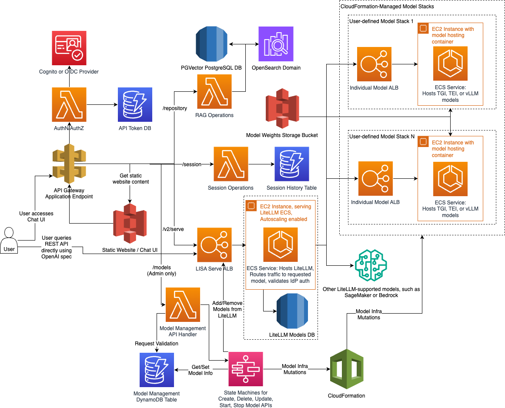

# LISA (LLM Inference Solution for Amazon Dedicated Cloud)

LISA is an infrastructure-as-code solution that supports model hosting and inference. Customers deploy LISA directly
into an AWS account and provision their own infrastructure. Customers bring their own models to LISA for hosting and
inference through Amazon ECS. LISA accelerates the use of Generative AI (GenAI) applications by providing scalable,
low latency access to customers’ generative LLMs and embedding language models. Customers can then focus on
experimenting with LLMs and developing GenAI applications.

LISA’s chatbot user interface can be used for experiment with features and for production use cases. LISA enhances model
output by integrating retrieval-augmented generation (RAG) with Amazon OpenSearch or PostgreSQL’s PGVector extension,
incorporating external knowledge sources into model responses. This helps reduce the need for fine-tuning and delivers
more contextually relevant outputs.

LISA supports OpenAI’s API Spec via the LiteLLM proxy. This means that LISA is compatible for customers to configure
with models hosted externally by supported model providers. LiteLLM also allows customers to use LISA to standardize
model orchestration and communication across model providers instead of managing each individually. With OpenAI API spec
support, LISA can also be used as a stand-in replacement for any application that already utilizes OpenAI-centric
tooling (ex: OpenAI’s Python library, LangChain).

---
# Table of Contents

- [LISA (LLM Inference Solution for Amazon Dedicated Cloud)](#lisa-llm-inference-solution-for-amazon-dedicated-cloud)
- [Breaking Changes in v2 to v3 Migration](#breaking-changes-in-v2-to-v3-migration)
- [Background](#background)
- [System Overview](#system-overview)
- [LISA Components](#lisa-components)
    - [LISA Model Management](#lisa-model-management)
    - [LISA Serve](#lisa-serve)
    - [LISA Chat](#lisa-chat)
- [Interaction Flow](#interaction-flow)
- [Getting Started with LISA](#getting-started-with-lisa)
    - [Prerequisites](#prerequisites)
    - [Step 1: Clone the Repository](#step-1-clone-the-repository)
    - [Step 2: Set Up Environment Variables](#step-2-set-up-environment-variables)
    - [Step 3: Set Up Python and TypeScript Environments](#step-3-set-up-python-and-typescript-environments)
    - [Step 4: Configure LISA](#step-4-configure-lisa)
    - [Step 5: Stage Model Weights](#step-5-stage-model-weights)
    - [Step 6: Configure Identity Provider](#step-6-configure-identity-provider)
    - [Step 7: Configure LiteLLM](#step-7-configure-litellm)
    - [Step 8: Set Up SSL Certificates (Development Only)](#step-8-set-up-ssl-certificates-development-only)
    - [Step 9: Customize Model Deployment](#step-9-customize-model-deployment)
    - [Step 10: Bootstrap CDK (If Not Already Done)](#step-10-bootstrap-cdk-if-not-already-done)
- [Recommended LiteLLM Configuration Options](#recommended-litellm-configuration-options)
- [API Usage Overview](#api-usage-overview)
    - [User-facing OpenAI-Compatible API](#user-facing-openai-compatible-api)
    - [Admin-level Model Management API](#admin-level-model-management-api)
- [Error Handling for API Requests](#error-handling-for-api-requests)
- [Deployment](#deployment)
    - [Using Pre-built Resources](#using-pre-built-resources)
    - [Deploying](#deploying)
- [Programmatic API Tokens](#programmatic-api-tokens)
- [Model Compatibility](#model-compatibility)
- [Chatbot Example](#chatbot-example)
- [Usage and Features](#usage-and-features)
    - [OpenAI Specification Compatibility](#openai-specification-compatibility)
    - [Continue JetBrains and VS Code Plugin](#continue-jetbrains-and-vs-code-plugin)
    - [Usage in LLM Libraries](#usage-in-llm-libraries)
- [License Notice](#license-notice)

---
# Breaking Changes in v2 to v3 Migration

With the release of LISA v3.0.0, we have introduced several architectural changes that are incompatible with previous versions. Although these changes may cause some friction for existing users, they aim to simplify the deployment experience and enhance long-term scalability. The following breaking changes are critical for existing users planning to upgrade:

1. Model Deletion Upon Upgrade: Models deployed via EC2 and ECS using the config.yaml file’s ecsModels list will be deleted during the upgrade process. LISA has migrated to a new model deployment system that manages models internally, rendering the ecsModels list obsolete. We recommend backing up your model settings to facilitate their redeployment through the new Model Management API with minimal downtime.
1. Networking Changes and Full Teardown: Core networking changes require a complete teardown of the existing LISA installation using the make destroy command before upgrading. Cross-stack dependencies have been modified, necessitating this full teardown to ensure proper application of the v3 infrastructure changes. Additionally, users may need to manually delete some resources, such as ECR repositories or S3 buckets, if they were populated before CloudFormation began deleting the stack. This operation is destructive and irreversible, so it is crucial to back up any critical configurations and data (e.g., S3 RAG bucket contents, DynamoDB token tables) before proceeding with the upgrade.
1. New LiteLLM Admin Key Requirement: The new Model Management API requires an "admin" key for LiteLLM to track models for inference requests. This key, while transparent to users, must be present and conform to the required format (starting with sk-). The key is defined in the config.yaml file, and the LISA schema validator will prompt an error if it is missing or incorrectly formatted.

---

## Background

LISA is a robust, AWS-native platform designed to simplify the deployment and management of Large Language Models (LLMs) in scalable, secure, and highly available environments. Drawing inspiration from the AWS open-source project [aws-genai-llm-chatbot](https://github.com/aws-samples/aws-genai-llm-chatbot), LISA builds on this foundation by offering more specialized functionality, particularly in the areas of security, modularity, and flexibility.

One of the key differentiators of LISA is its ability to leverage the [text-generation-inference](https://github.com/huggingface/text-generation-inference/tree/main) text-generation-inference container from HuggingFace, allowing users to deploy cutting-edge LLMs. LISA also introduces several innovations that extend beyond its inspiration:

1. **Support for Amazon Dedicated Cloud (ADC):** LISA is designed to operate in highly controlled environments like Amazon Dedicated Cloud (ADC) partitions, making it ideal for industries with stringent regulatory and security requirements. This focus on secure, isolated deployments differentiates LISA from other open-source platforms.
1. **Modular Design for Composability:** LISA's architecture is designed to be composable, splitting its components into distinct services. The core components, LISA Serve (for LLM serving and inference) and LISA Chat (for the chat interface), can be deployed as independent stacks. This modularity allows users to deploy only the parts they need, enhancing flexibility and scalability across different deployment environments.
1. **OpenAI API Specification Support:** LISA is built to support the OpenAI API specification, allowing users to replace OpenAI’s API with LISA without needing to change existing application code. This makes LISA a drop-in replacement for any workflow or application that already leverages OpenAI’s tooling, such as the OpenAI Python library or LangChain.

---

## System Overview

LISA is designed using a modular, microservices-based architecture, where each service performs a distinct function. It is composed of three core components: LISA Model Management, LISA Serve, and LISA Chat. Each of these components is responsible for specific functionality and interacts via well-defined API endpoints to ensure scalability, security, and fault tolerance across the system.

**Key System Functionalities:**

* **Authentication and Authorization** via AWS Cognito or OpenID Connect (OIDC) providers, ensuring secure access to both the REST API and Chat UI through token-based authentication and role-based access control.
* **Model Hosting** on AWS ECS with autoscaling and efficient traffic management using Application Load Balancers (ALBs), providing scalable and high-performance model inference.
* **Model Management** using AWS Step Functions to orchestrate complex workflows for creating, updating, and deleting models, automatically managing underlying ECS infrastructure.
* **Inference Requests** served via both the REST API and the Chat UI, dynamically routing user inputs to the appropriate ECS-hosted models for real-time inference.
* **Chat Interface** enabling users to interact with LISA through a user-friendly web interface, offering seamless real-time model interaction and session continuity.
* **Retrieval-Augmented Generation (RAG) Operations**, leveraging either OpenSearch or PGVector for efficient retrieval of relevant external data to enhance model responses.

---

## LISA Components

### LISA Model Management

The Model Management component is responsible for managing the entire lifecycle of models in LISA. This includes creation, updating, deletion, and scaling of models deployed on ECS. The system automates and scales these operations, ensuring that the underlying infrastructure is managed efficiently.

* **Model Hosting**: Models are containerized and deployed on AWS ECS, with each model hosted in its own isolated ECS task. This design allows models to be independently scaled based on demand. Traffic to the models is balanced using Application Load Balancers (ALBs), ensuring that the autoscaling mechanism reacts to load fluctuations in real time, optimizing both performance and availability.
* **External Model Routing**: LISA utilizes the LiteLLM proxy to route traffic to different model providers, no matter their API and payload format. Users may add models from external providers, such as SageMaker or Bedrock, to their system to allow requests to models hosted in those systems and services. LISA will simply add the configuration to LiteLLM without creating any additional supporting infrastructure.
* **Model Lifecycle Management**: AWS Step Functions are used to orchestrate the lifecycle of models, handling the creation, update, and deletion workflows. Each workflow provisions the required resources using CloudFormation templates, which manage infrastructure components like EC2 instances, security groups, and ECS services. The system ensures that the necessary security, networking, and infrastructure components are automatically deployed and configured.
    * The CloudFormation stacks define essential resources using the LISA core VPC configuration, ensuring best practices for security and access across all resources in the environment.
    * DynamoDB stores model metadata, while Amazon S3 securely manages model weights, enabling ECS instances to retrieve the weights dynamically during deployment.

#### Technical Implementation

* **Model Lifecycle**: Lifecycle operations such as creation, update, and deletion are executed by Step Functions and backed by AWS Lambda in ```lambda/models/lambda_functions.py```.
* **CloudFormation**: Infrastructure components are provisioned using CloudFormation templates, as defined in ```ecs_model_deployer/src/lib/lisa_model_stack.ts```.
* **ECS Cluster**: ECS cluster and task definitions are located in ```ecs_model_deployer/src/lib/ecsCluster.ts```, with model containers specified in ```ecs_model_deployer/src/lib/ecs-model.ts```.

---

### LISA Serve

LISA Serve is responsible for processing inference requests and serving model predictions. This component manages user requests to interact with LLMs and ensures that the models deliver low-latency responses.

* **Inference Requests**: Requests are routed via ALB, which serves as the main entry point to LISA’s backend infrastructure. The ALB forwards requests to the appropriate ECS-hosted model or externally-hosted model based on the request parameters. For models hosted within LISA, traffic to the models is managed with model-specific ALBs, which enable autoscaling if the models are under heavy load. LISA supports both direct REST API-based interaction and interaction through the Chat UI, enabling programmatic access or a user-friendly chat experience.
* **RAG (Retrieval-Augmented Generation)**: RAG operations enhance model responses by integrating external data sources. LISA leverages OpenSearch or PGVector (PostgreSQL) as vector stores, enabling vector-based search and retrieval of relevant knowledge to augment LLM outputs dynamically.

#### Technical Implementation

* RAG operations are managed through ```lambda/rag/lambda_functions.py```, which handles embedding generation and document retrieval via OpenSearch and PostgreSQL.
* Direct requests to the LISA Serve ALB entrypoint must utilize the OpenAI API spec, which we support through the use of the LiteLLM proxy.

---

### LISA Chat

LISA Chat provides a customizable chat interface that enables users to interact with models in real-time. This component ensures that users have a seamless experience for submitting queries and maintaining session continuity.

* **Chat Interface**: The Chat UI is hosted as a static website on Amazon S3 and is served via API Gateway. Users can interact with models directly through the web-based frontend, sending queries and viewing real-time responses from the models. The interface is integrated with LISA's backend services for model inference, retrieval augmented generation, and session management.
* **Session History Management**: LISA maintains session histories using DynamoDB, allowing users to retrieve and continue previous conversations seamlessly. This feature is crucial for maintaining continuity in multi-turn conversations with the models.

#### Technical Implementation

* The Chat UI is implemented in the ```lib/user-interface/react/``` folder and is deployed using the scripts in the ```scripts/``` folder.
* Session management logic is handled in ```lambda/session/lambda_functions.py```, where session data is stored and retrieved from DynamoDB.
* RAG operations are defined in lambda/repository/lambda_functions.py

---

## Interaction Flow

1. **User Interaction with Chat UI or API:** Users can interact with LISA through the Chat UI or REST API. Each interaction is authenticated using AWS Cognito or OIDC, ensuring secure access.
1. **Request Routing:** The API Gateway securely routes user requests to the appropriate backend services, whether for fetching the chat UI, performing RAG operations, or managing models.
1. **Model Management:** Administrators can deploy, update, or delete models via the Model Management API, which triggers ECS deployment and scaling workflows.
1. **Model Inference:** Inference requests are routed to ECS-hosted models or external models via the LiteLLM proxy. Responses are served back to users through the ALB.
1. **RAG Integration:** When RAG is enabled, LISA retrieves relevant documents from OpenSearch or PGVector, augmenting the model's response with external knowledge.
1. **Session Continuity:** User session data is stored in DynamoDB, ensuring that users can retrieve and continue previous conversations across multiple interactions.
1. **Autoscaling:** ECS tasks automatically scale based on system load, with ALBs distributing traffic across available instances to ensure performance.

---

# Getting Started with LISA

LISA (LLM Inference Solution for Amazon Dedicated Cloud) is an advanced infrastructure solution for deploying and
managing Large Language Models (LLMs) on AWS. This guide will walk you through the setup process, from prerequisites
to deployment.

## Prerequisites

Before beginning, ensure you have:

1. An AWS account with appropriate permissions
2. AWS CLI installed and configured
3. Familiarity with AWS Cloud Development Kit (CDK) and infrastructure-as-code principles
4. Python 3.9 or later
5. Node.js 14 or later
6. Docker installed and running
7. Sufficient disk space for model downloads and conversions

If you're new to CDK, review the [AWS CDK Documentation](https://docs.aws.amazon.com/cdk/v2/guide/getting_started.html) and consult with your AWS support team.

---

## Step 1: Clone the Repository

Ensure you're working with the latest stable release of LISA:

```bash
git clone -b main --single-branch <path-to-lisa-repo>
cd lisa
```

---

## Step 2: Set Up Environment Variables

Create and configure your `config.yaml` file:

```bash
cp example_config.yaml config.yaml
```

Set the following environment variables:

```bash
export PROFILE=my-aws-profile  # Optional, can be left blank
export DEPLOYMENT_NAME=my-deployment
export ENV=dev  # Options: dev, test, or prod
```

---

## Step 3: Set Up Python and TypeScript Environments

Install system dependencies and set up both Python and TypeScript environments:

```bash
# Install system dependencies
sudo apt-get update
sudo apt-get install -y jq

# Install Python packages
pip3 install --user --upgrade pip
pip3 install yq huggingface_hub s5cmd

# Set up Python environment
make createPythonEnvironment

# Activate your python environment
# The command is the output from the previous make command)

# Install Python Requirements
make installPythonRequirements

# Set up TypeScript environment
make createTypeScriptEnvironment
make installTypeScriptRequirements
```

---

## Step 4: Configure LISA

Edit the `config.yaml` file to customize your LISA deployment. Key configurations include:

- AWS account and region settings
- Model configurations
- Authentication settings
- Networking and infrastructure preferences

---

## Step 5: Stage Model Weights

LISA uses your AWS account's S3 bucket for model storage. Ensure your S3 bucket is structured as follows:

```
s3://<bucket-name>/<hf-model-id-1>
s3://<bucket-name>/<hf-model-id-1>/<file-1>
s3://<bucket-name>/<hf-model-id-1>/<file-2>
...
s3://<bucket-name>/<hf-model-id-2>
```

To optimize startup time, convert models to `.safetensors` format:

```bash
make modelCheck
```

This command will check for models, download them if necessary, and convert them to the required format. Ensure you have sufficient disk space for this operation.

For air-gapped systems, manually download model artifacts and place them in a `models` directory in the project root, following the structure: `models/<model-id>`.

**Note:** We have primarily designed and tested this with HuggingFace models in mind. Any models outside of this format will require you to create and upload safetensors manually.

---

## Step 6: Configure Identity Provider

In the `config.yaml` file, configure the `authConfig` block for authentication. LISA supports OpenID Connect (OIDC) providers such as AWS Cognito or Keycloak. Required fields include:

- `authority`: URL of your identity provider
- `clientId`: Client ID for your application
- `adminGroup`: Group name for users with model management permissions
- `jwtGroupsProperty`: Path to the groups field in the JWT token
- `additionalScopes` (optional): Extra scopes for group membership information

#### Cognito Configuration Example:
In Cognito, the `authority` will be the URL to your User Pool. As an example, if your User Pool ID, not the name, is `us-east-1_example`, and if it is
running in `us-east-1`, then the URL to put in the `authority` field would be `https://cognito-idp.us-east-1.amazonaws.com/us-east-1_example`. The `clientId`
can be found in your User Pool's "App integration" tab from within the AWS Management Console, and at the bottom of the page, you will see the list of clients
and their associated Client IDs. The ID here is what we will need for the `clientId` field.


```yaml
authConfig:
  authority: https://cognito-idp.us-east-1.amazonaws.com/us-east-1_example
  clientId: your-client-id
  adminGroup: AdminGroup
  jwtGroupsProperty: cognito:groups
```

#### Keycloak Configuration Example:
In Keycloak, the `authority` will be the URL to your Keycloak server. The `clientId` is likely not a random string like in the Cognito clients, and instead
will be a string configured by your Keycloak administrator. Your administrator will be able to give you a client name or create a client for you to use for
this application. Once you have this string, use that as the `clientId` within the `authConfig` block.

```yaml
authConfig:
  authority: https://your-keycloak-server.com
  clientId: your-client-name
  adminGroup: AdminGroup
  jwtGroupsProperty: realm_access.roles
```

---

## Step 7: Configure LiteLLM
We utilize LiteLLM under the hood to allow LISA to respond to the [OpenAI specification](https://platform.openai.com/docs/api-reference).
With the models that we are hosted using the process above, we automatically add them to our LiteLLM configuration with
no additional configuration required from the user. We expose the [LiteLLM configuration](https://litellm.vercel.app/docs/proxy/configs)
file directly within the LISA config.yaml file, so any options defined there can be defined directly in the LISA config file, under the `litellmConfig` option.
This also means that we will also support calling other existing models that your VPC configuration allows. For more
information about adding models, please see the LiteLLM docs [here](https://litellm.vercel.app/docs/proxy/configs).

For the LISA implementation, we added one more block under the models within the `model_list` so that we can gather information about your
models for usage in the LISA Chat UI. We ask for whether the model is a `textgen` or `embedding` model, and then if the model is a `textgen`
model, we ask if it supports streaming or not. If the model is an embedding model, then the `streaming` option must be null or omitted.
These fields will allow us to organize the models in the Chat UI so that the models show in
the correct locations. These fields can be seen in the example configuration below.


```yaml
litellmConfig:
  litellm_settings:
    telemetry: false
    drop_params: true
  model_list:
    - model_name: example-model
      litellm_params:
        model: sagemaker/example-endpoint
        api_key: ignored
      lisa_params:
        model_type: textgen
        streaming: true
```

This configuration supports various model types, including SageMaker endpoints, Bedrock models, and custom OpenAI-compatible models.

---

## Step 8: Set Up SSL Certificates (Development Only)

**WARNING: THIS IS FOR DEV ONLY**
When deploying for dev and testing you can use a self-signed certificate for the REST API ALB. You can create this by using the script: `gen-cert.sh` and uploading it to `IAM`.

```bash
export REGION=<your-region>
./scripts/gen-certs.sh
aws iam upload-server-certificate --server-certificate-name <cert-name> --certificate-body file://scripts/server.pem --private-key file://scripts/server.key
```

Update your `config.yaml` with the certificate ARN:

```yaml
restApiConfig:
  loadBalancerConfig:
    sslCertIamArn: arn:aws:iam::<account-number>:server-certificate/<certificate-name>
```
---

## Step 9: Customize Model Deployment

In the `ecsModels` section of `config.yaml`, configure the models you want to deploy.

The configuration file will determine which models are deployed. In order to deploy an additional model or a
different model the only required change is to the configuration file, as long as it is compatible with the inference
container. Specifically, see the `ecsModels` section of the [config.yaml](./config.yaml) file.
Here we define the model name, if we want to deploy, the type of instance we want to deploy to, the type of model
(textgen or embedding), the inference container and then the containerConfig. There are many more parameters for the
ecs models, many for autoscaling and health checks. However, let's focus on the model specific ones:

```yaml
ecsModels:
  - modelName: your-model-name
    deploy: false
    instanceType: g4dn.12xlarge
    modelType: textgen
    inferenceContainer: tgi
    containerConfig:
      baseImage: ghcr.io/huggingface/text-generation-inference:1.0.2
      environment:
        QUANTIZE: bitsandbytes-nf4
        MAX_CONCURRENT_REQUESTS: 128
        MAX_INPUT_LENGTH: 1024
        MAX_TOTAL_TOKENS: 2048
```

Adjust these parameters based on your specific model requirements and performance needs. These parameters will
be used when the model endpoint is deployed and are likely to change with different model types. For more information
on these parameters please see the [inference container documentation](https://github.com/huggingface/text-generation-inference/tree/main).

---

## Step 10: Bootstrap CDK (If Not Already Done)

If you haven't bootstrapped your AWS account for CDK:

```bash
make bootstrap
```

---

## Recommended LiteLLM Configuration Options

While LISA is designed to be flexible, configuring external models requires careful consideration. The following guide
provides a recommended minimal setup for integrating various model types with LISA using LiteLLM.

### Configuration Overview

This example configuration demonstrates how to set up:
1. A SageMaker Endpoint
2. An Amazon Bedrock Model
3. A self-hosted OpenAI-compatible text generation model
4. A self-hosted OpenAI-compatible embedding model

**Note:** Ensure that all endpoints and models are in the same AWS region as your LISA installation.

### SageMaker Endpoints and Bedrock Models

LISA supports adding existing SageMaker Endpoints and Bedrock Models to the LiteLLM configuration. As long as these
services are in the same region as the LISA installation, LISA can use them alongside any other deployed models.

**To use a SageMaker Endpoint:**
1. Install LISA without initially referencing the SageMaker Endpoint.
2. Create a SageMaker Model using the private subnets of the LISA deployment.
3. This setup allows the LISA REST API container to communicate with any Endpoint using that SageMaker Model.

**SageMaker Endpoints and Bedrock Models can be configured:**
- Statically at LISA deployment time
- Dynamically using the LISA Model Management API

**Important:** Endpoints or Models statically defined during LISA deployment cannot be removed or updated using the
LISA Model Management API.

### Example Configuration

```yaml
dev:
  litellmConfig:
    litellm_settings:
      telemetry: false  # Disable telemetry to LiteLLM servers (recommended for VPC deployments)
      drop_params: true # Ignore unrecognized parameters instead of failing

    model_list:
      # 1. SageMaker Endpoint Configuration
      - model_name: test-endpoint # Human-readable name, can be anything and will be used for OpenAI API calls
        litellm_params:
          model: sagemaker/test-endpoint # Prefix required for SageMaker Endpoints and "test-endpoint" matches Endpoint name
          api_key: ignored # Provide an ignorable placeholder key to avoid LiteLLM deployment failures
        lisa_params:
          model_type: textgen
          streaming: true

      # 2. Amazon Bedrock Model Configuration
      - model_name: bedrock-titan-express # Human-readable name for future OpenAI API calls
        litellm_params:
          model: bedrock/amazon.titan-text-express-v1 # Prefix required for Bedrock Models, and exact name of Model to use
          api_key: ignored # Provide an ignorable placeholder key to avoid LiteLLM deployment failures
        lisa_params:
          model_type: textgen
          streaming: true

      # 3. Custom OpenAI-compatible Text Generation Model
      - model_name: custom-openai-model # Used in future OpenAI-compatible calls to LiteLLM
        litellm_params:
          model: openai/custom-provider/textgen-model  # Format: openai/<provider>/<model-name>
          api_base: https://your-domain-here:443/v1 # Your model's base URI
          api_key: ignored # Provide an ignorable placeholder key to avoid LiteLLM deployment failures
        lisa_params:
          model_type: textgen
          streaming: true

      # 4. Custom OpenAI-compatible Embedding Model
      - model_name: custom-openai-embedding-model # Used in future OpenAI-compatible calls to LiteLLM
        litellm_params:
          model: openai/modelProvider/modelName # Prefix required for OpenAI-compatible models followed by model provider and name details
          api_base: https://your-domain-here:443/v1 # Your model's base URI
          api_key: ignored # Provide an ignorable placeholder key to avoid LiteLLM deployment failures
        lisa_params:
          model_type: embedding
```

---

# API Usage Overview

LISA provides robust API endpoints for managing models, both for users and administrators. These endpoints allow for operations such as listing, creating, updating, and deleting models.

## API Gateway and ALB Endpoints

LISA uses two primary APIs for model management:

1. **User-facing OpenAI-Compatible API**: Available to all users for inference tasks and accessible through the LISA Serve ALB. This API provides an interface for querying and interacting with models deployed on Amazon ECS, Amazon Bedrock, or through LiteLLM.
2. **Admin-level Model Management API**: Available only to administrators through the API Gateway (APIGW). This API allows for full control of model lifecycle management, including creating, updating, and deleting models.

### LiteLLM Routing in All Models

Every model request is routed through LiteLLM, regardless of whether infrastructure (like ECS) is created for it. Whether deployed on ECS, external models via Bedrock, or managed through LiteLLM, all models are added to LiteLLM for traffic routing. The distinction is whether infrastructure is created (determined by request payloads), but LiteLLM integration is consistent for all models. The model management APIs will handle adding or removing model configurations from LiteLLM, and the LISA Serve endpoint will handle the inference requests against models available in LiteLLM.

## User-facing OpenAI-Compatible API

The OpenAI-compatible API is accessible through the LISA Serve ALB and allows users to list models available for inference tasks. Although not specifically part of the model management APIs, any model that is added or removed from LiteLLM via the model management API Gateway APIs will be reflected immediately upon queries to LiteLLM through the LISA Serve ALB.

### Listing Models

The `/v2/serve/models` endpoint on the LISA Serve ALB allows users to list all models available for inference in the LISA system.

#### Request Example:

```bash
curl -s -H 'Authorization: Bearer <your_token>' -X GET https://<alb_endpoint>/v2/serve/models
```

#### Response Example:

```json
{
  "data": [
    {
      "id": "bedrock-embed-text-v2",
      "object": "model",
      "created": 1677610602,
      "owned_by": "openai"
    },
    {
      "id": "titan-express-v1",
      "object": "model",
      "created": 1677610602,
      "owned_by": "openai"
    },
    {
      "id": "sagemaker-amazon-mistrallite",
      "object": "model",
      "created": 1677610602,
      "owned_by": "openai"
    }
  ],
  "object": "list"
}
```

#### Explanation of Response Fields:

These fields are all defined by the OpenAI API specification, which is documented [here](https://platform.openai.com/docs/api-reference/models/list).

- `id`: A unique identifier for the model.
- `object`: The type of object, which is "model" in this case.
- `created`: A Unix timestamp representing when the model was created.
- `owned_by`: The entity responsible for the model, such as "openai."

## Admin-level Model Management API

This API is only accessible by administrators via the API Gateway and is used to create, update, and delete models. It supports full model lifecycle management.

### Listing Models (Admin API)

The `/models` route allows admins to list all models managed by the system. This includes models that are either creating, deleting, already active, or in a failed state. Models can be deployed via ECS or managed externally through a LiteLLM configuration.

#### Request Example:

```bash
curl -s -H "Authorization: Bearer <admin_token>" -X GET https://<apigw_endpoint>/models
```

#### Response Example:

```json
{
  "models": [
    {
      "autoScalingConfig": {
        "minCapacity": 1,
        "maxCapacity": 1,
        "cooldown": 420,
        "defaultInstanceWarmup": 180,
        "metricConfig": {
          "albMetricName": "RequestCountPerTarget",
          "targetValue": 30,
          "duration": 60,
          "estimatedInstanceWarmup": 330
        }
      },
      "containerConfig": {
        "baseImage": {
          "baseImage": "vllm/vllm-openai:v0.5.0",
          "path": "vllm",
          "type": "asset"
        },
        "sharedMemorySize": 2048,
        "healthCheckConfig": {
          "command": [
            "CMD-SHELL",
            "exit 0"
          ],
          "interval": 10,
          "startPeriod": 30,
          "timeout": 5,
          "retries": 3
        },
        "environment": {
          "MAX_TOTAL_TOKENS": "2048",
          "MAX_CONCURRENT_REQUESTS": "128",
          "MAX_INPUT_LENGTH": "1024"
        }
      },
      "loadBalancerConfig": {
        "healthCheckConfig": {
          "path": "/health",
          "interval": 60,
          "timeout": 30,
          "healthyThresholdCount": 2,
          "unhealthyThresholdCount": 10
        }
      },
      "instanceType": "g5.xlarge",
      "modelId": "mistral-vllm",
      "modelName": "mistralai/Mistral-7B-Instruct-v0.2",
      "modelType": "textgen",
      "modelUrl": null,
      "status": "Creating",
      "streaming": true
    },
    {
      "autoScalingConfig": null,
      "containerConfig": null,
      "loadBalancerConfig": null,
      "instanceType": null,
      "modelId": "titan-express-v1",
      "modelName": "bedrock/amazon.titan-text-express-v1",
      "modelType": "textgen",
      "modelUrl": null,
      "status": "InService",
      "streaming": true
    }
  ]
}
```

#### Explanation of Response Fields:

- `modelId`: A unique identifier for the model.
- `modelName`: The name of the model, typically referencing the underlying service (Bedrock, SageMaker, etc.).
- `status`: The current state of the model, e.g., "Creating," "Active," or "Failed."
- `streaming`: Whether the model supports streaming inference.
- `instanceType` (optional): The instance type if the model is deployed via ECS.

### Creating a Model (Admin API)

LISA provides the `/models` endpoint for creating both ECS and LiteLLM-hosted models. Depending on the request payload, infrastructure will be created or bypassed (e.g., for LiteLLM-only models).

#### Request Example:

```
POST https://<apigw_endpoint>/models
```

#### Example Payload for ECS Model:

```json
{
  "modelId": "mistral-vllm",
  "modelName": "mistralai/Mistral-7B-Instruct-v0.2",
  "modelType": "textgen",
  "instanceType": "g5.xlarge",
  "streaming": true,
  "containerConfig": {
    "baseImage": {
      "baseImage": "vllm/vllm-openai:v0.5.0",
      "path": "vllm",
      "type": "asset"
    },
    "sharedMemorySize": 2048,
    "environment": {
      "MAX_CONCURRENT_REQUESTS": "128",
      "MAX_INPUT_LENGTH": "1024",
      "MAX_TOTAL_TOKENS": "2048"
    },
    "healthCheckConfig": {
      "command": ["CMD-SHELL", "exit 0"],
      "interval": 10,
      "startPeriod": 30,
      "timeout": 5,
      "retries": 3
    }
  },
  "autoScalingConfig": {
    "minCapacity": 1,
    "maxCapacity": 1,
    "cooldown": 420,
    "metricConfig": {
      "albMetricName": "RequestCountPerTarget",
      "targetValue": 30,
      "duration": 60
    }
  },
  "loadBalancerConfig": {
    "healthCheckConfig": {
      "path": "/health",
      "interval": 60,
      "timeout": 30,
      "healthyThresholdCount": 2,
      "unhealthyThresholdCount": 10
    }
  }
}
```

#### Creating a LiteLLM-Only Model:

```json
{
  "modelId": "titan-express-v1",
  "modelName": "bedrock/amazon.titan-text-express-v1",
  "modelType": "textgen",
  "streaming": true
}
```

#### Explanation of Key Fields for Creation Payload:

- `modelId`: The unique identifier for the model.
- `modelName`: The name of the model as it appears in the system.
- `modelType`: The type of model, such as text generation (textgen).
- `streaming`: Whether the model supports streaming inference.
- `instanceType`: The type of EC2 instance to be used (only applicable for ECS models).
- `containerConfig`: Details about the Docker container, memory allocation, and environment variables.
- `autoScalingConfig`: Configuration related to ECS autoscaling.
- `loadBalancerConfig`: Health check configuration for load balancers.

### Deleting a Model (Admin API)

Admins can delete a model using the following endpoint. Deleting a model removes the infrastructure (ECS) or disconnects from LiteLLM.

#### Request Example:

```
DELETE https://<apigw_endpoint>/models/{modelId}
```

#### Response Example:

```json
{
  "status": "success",
  "message": "Model mistral-vllm has been deleted successfully."
}
```

---

# Error Handling for API Requests

In the LISA model management API, error handling is designed to ensure robustness and consistent responses when errors occur during the execution of API requests. This section provides a detailed explanation of the error handling mechanisms in place, including the types of errors that are managed, how they are raised, and what kind of responses clients can expect when these errors occur.

## Common Errors and Their HTTP Responses

Below is a list of common errors that can occur in the system, along with the HTTP status codes and response structures that are returned to the client.

### ModelNotFoundError

* **Description**: Raised when a model that is requested for retrieval or deletion is not found in the system.
* **HTTP Status Code**: `404 Not Found`
* **Response Body**:

```json
{
    "error": "ModelNotFoundError",
    "message": "The requested model with ID <model_id> could not be found."
}
```

* **Example Scenario**: When a client attempts to fetch details of a model that does not exist in the database, the `ModelNotFoundError` is raised.

### ModelAlreadyExistsError

* **Description:** Raised when a request to create a model is made, but the model already exists in the system.
* **HTTP Status Code**: `400`
* **Response Body**:

```json
{
    "error": "ModelAlreadyExistsError",
    "message": "A model with the given configuration already exists."
}
```

* **Example Scenario:** A client attempts to create a model with an ID or name that already exists in the database. The system detects the conflict and raises the `ModelAlreadyExistsError`.

### InvalidInputError (Hypothetical Example)

* **Description**: Raised when the input provided by the client for creating or updating a model is invalid or does not conform to expected formats.
* **HTTP Status Code**: `400 Bad Request`
* **Response Body**:

```json
{
    "error": "InvalidInputError",
    "message": "The input provided is invalid. Please check the required fields and formats."
}
```

* **Example Scenario**: The client submits a malformed JSON body or omits required fields in a model creation request, triggering an `InvalidInputError`.

## Handling Validation Errors

Validation errors are handled across the API via utility functions and model transformation logic. These errors typically occur when user inputs fail validation checks or when required data is missing from a request.

### Example Response for Validation Error:

* **HTTP Status Code**: `422 Unprocessable Entity`
* **Response Body**:

```json
{
    "error": "ValidationError",
    "message": "The input provided does not meet the required validation criteria."
}
```

---

# Deployment
## Using pre-built resources

A default configuration will build the necessary containers, lambda layers, and production optimized
web application at build time. In the event that you would like to use pre-built resources due to
network connectivity reasons or other concerns with the environment where you'll be deploying LISA
you can do so.

- For ECS containers (Models, APIs, etc) you can modify the `containerConfig` block of
  the corresponding entry in `config.yaml`. For container images you can provide a path to a directory
  from which a docker container will be built (default), a path to a tarball, an ECR repository arn and
  optional tag, or a public registry path.
    - We provide immediate support for HuggingFace TGI and TEI containers and for vLLM containers. The `example_config.yaml`
      file provides examples for TGI and TEI, and the only difference for using vLLM is to change the
      `inferenceContainer`, `baseImage`, and `path` options, as indicated in the snippet below. All other options can
      remain the same as the model definition examples we have for the TGI or TEI models. vLLM can also support embedding
      models in this way, so all you need to do is refer to the embedding model artifacts and remove the `streaming` field
      to deploy the embedding model.
    - vLLM has support for the OpenAI Embeddings API, but model support for it is limited because the feature is new. Currently,
      the only supported embedding model with vLLM is [intfloat/e5-mistral-7b-instruct](https://huggingface.co/intfloat/e5-mistral-7b-instruct),
      but this list is expected to grow over time as vLLM updates.
      ```yaml
      ecsModels:
        - modelName: mistralai/Mistral-7B-Instruct-v0.2
          modelId: mistral7b-vllm
          deploy: false
          modelType: textgen # can also be 'embedding'
          streaming: true # remove option if modelType is 'embedding'
          instanceType: g5.xlarge
          inferenceContainer: vllm # vLLM-specific config
          containerConfig:
            image:
              baseImage: vllm/vllm-openai:v0.5.0 # vLLM-specific config
              path: lib/serve/ecs-model/vllm # vLLM-specific config
      ```
- If you are deploying the LISA Chat User Interface you can optionally specify the path to the pre-built
  website assets using the top level `webAppAssetsPath` parameter in `config.yaml`. Specifying this path
  (typically `lib/user-interface/react/dist`) will avoid using a container to build and bundle the assets
  at CDK build time.
- For the lambda layers you can specify the path to a local zip archive of the layer code by including
  the optional `lambdaLayerAssets` block in `config.yaml` similar to the following:

```
lambdaLayerAssets:
  authorizerLayerPath: lib/core/layers/authorizer_layer.zip
  commonLayerPath: lib/core/layers/common_layer.zip
  fastapiLayerPath: /path/to/fastapi_layer.zip
  sdkLayerPath: lib/rag/layers/sdk_layer.zip
```
---

## Deploying

Now that we have everything setup we are ready to deploy.

```bash
make deploy
```

By default, all stacks will be deployed but a particular stack can be deployed by providing the `STACK` argument to the `deploy` target.

```bash
make deploy STACK=LisaServe
```

Available stacks can be listed by running:

```bash
make listStacks
```

After the `deploy` command is run, you should see many docker build outputs and eventually a CDK progress bar. The deployment should take about 10-15 minutes and will produce a single cloud formation output for the websocket URL.

You can test the deployment with the integration test:

```bash
pytest lisa-sdk/tests --url <rest-url-from-cdk-output> --verify <path-to-server.crt> | false
```

---

## Programmatic API Tokens

The LISA Serve ALB can be used for programmatic access outside the example Chat application.
An example use case would be for allowing LISA to serve LLM requests that originate from the [Continue VSCode Plugin](https://www.continue.dev/).
To facilitate communication directly with the LISA Serve ALB, a user with sufficient DynamoDB PutItem permissions may add
API keys to the APITokenTable, and once created, a user may make requests by including the `Authorization: Bearer ${token}`
header or the `Api-Key: ${token}` header with that token. If using any OpenAI-compatible library, the `api_key` fields
will use the `Authorization: Bearer ${token}` format automatically, so there is no need to include additional headers
when using those libraries.

### Adding a Token

An account owner may create a long-lived API Token using the following AWS CLI command.

```bash
AWS_REGION="us-east-1"  # change to your deployment region
token_string="YOUR_STRING_HERE"  # change to a unique string for a user
aws --region $AWS_REGION dynamodb put-item --table-name $DEPLOYMENT_NAME-LISAApiTokenTable \
    --item '{"token": {"S": "'${token_string}'"}}'
```

If an account owner wants the API Token to be temporary and expire after a specific date, LISA will allow for this too.
In addition to the `token` field, the owner may specify the `tokenExpiration` field, which accepts a UNIX timestamp,
in seconds. The following command shows an example of how to do this.

```bash
AWS_REGION="us-east-1"  # change to your deployment region
token_string="YOUR_STRING_HERE"
token_expiration=$(echo $(date +%s) + 3600 | bc)  # token that expires in one hour, 3600 seconds
aws --region $AWS_REGION dynamodb put-item --table-name $DEPLOYMENT_NAME-LISAApiTokenTable \
    --item '{
        "token": {"S": "'${token_string}'"},
        "tokenExpiration": {"N": "'${token_expiration}'"}
    }'
```

Once the token is inserted into the DynamoDB Table, a user may use the token in the `Authorization` request header like
in the following snippet.

```bash
lisa_serve_rest_url="https://<rest-url-from-cdk-output>"
token_string="YOUR_STRING_HERE"
curl ${lisa_serve_rest_url}/v2/serve/models \
    -H 'accept: application/json' \
    -H 'Content-Type: application/json' \
    -H "Authorization: Bearer ${token_string}"
```

### Updating a Token

In the case that an owner wishes to change an existing expiration time or add one to a key that did not previously have
an expiration, this can be accomplished by editing the existing item. The following commands can be used as an example
for updating an existing token. Setting the expiration time to a time in the past will effectively remove access for
that key.

```bash
AWS_REGION="us-east-1"  # change to your deployment region
token_string="YOUR_STRING_HERE"
token_expiration=$(echo $(date +%s) + 600 | bc)  # token that expires in 10 minutes from now
aws --region $AWS_REGION dynamodb update-item --table-name $DEPLOYMENT_NAME-LISAApiTokenTable \
    --key '{"token": {"S": "'${token_string}'"}}' \
    --update-expression 'SET tokenExpiration=:t' \
    --expression-attribute-values '{":t": {"N": "'${token_expiration}'"}}'
```

### Removing a Token

Tokens will not be automatically removed even if they are no longer valid. An owner may remove an key, expired or not,
from the database to fully revoke the key, by deleting the item. As an example, the following commands can be used to
remove a token.

```bash
AWS_REGION="us-east-1"  # change to your deployment region
token_string="YOUR_STRING_HERE"  # change to the token to remove
aws --region $AWS_REGION dynamodb delete-item --table-name $DEPLOYMENT_NAME-LISAApiTokenTable \
    --key '{"token": {"S": "'${token_string}'"}}'
```

---

## Model Compatibility

### HuggingFace Generation Models

For generation models, or causal language models, LISA supports models that are supported by the underlying serving container, TGI. TGI divides compatibility into two categories: optimized models and best effort supported models. The list of optimized models is found [here](https://huggingface.co/docs/text-generation-inference/supported_models). The best effort uses the `transformers` codebase under-the-hood and so should work for most causal models on HuggingFace:

```python
AutoModelForCausalLM.from_pretrained(<model>, device_map="auto")
```

or

```python
AutoModelForSeq2SeqLM.from_pretrained(<model>, device_map="auto")
```

### HuggingFace Embedding Models

Embedding models often utilize custom codebases and are not as uniform as generation models. For this reason you will likely need to create a new `inferenceContainer`. Follow the [example](./lib/ecs-model/embedding/instructor) provided for the `instructor` model.

### vLLM Models

In addition to the support we have for the TGI and TEI containers, we support hosting models using the [vLLM container](https://docs.vllm.ai/en/latest/). vLLM abides by the OpenAI specification, and as such allows both text generation and embedding on the models that vLLM supports.
See the [deployment](#deployment) section for details on how to set up the vLLM container for your models. Similar to how the HuggingFace containers will serve safetensor weights downloaded from the
HuggingFace website, vLLM will do the same, and our configuration will allow you to serve these artifacts automatically. vLLM does not have many supported models for embeddings, but as they become available,
LISA will support them as long as the vLLM container version is updated in the config.yaml file and as long as the model's safetensors can be found in S3.

---

# Chatbot Example

This repository include an example chatbot web application. The react based web application can be optionally deployed to demonstrate the capabilities of LISA Serve. The chatbot consists of a static react based single page application hosted via API GW S3 proxy integration. The app connects to the LISA Serve REST API and an optional RAG API. The app integrates with an OIDC compatible IdP and allows users to interact directly with any of the textgen models hosted with LISA Serve. If the optional RAG stack is deployed then users can also leverage the embeddings models and AWS OpenSearch or PGVector to demonstrate chat with RAG. Chat sessions are maintained in dynamodb table and a number of parameters are exposed through the UI to allow experimentation with various parameters including prompt, temperature, top k, top p, max tokens, and more.

## Local development

### Configuring Pre-Commit Hooks

To ensure code quality and consistency, this project uses pre-commit hooks. These hooks are configured to perform checks, such as linting and formatting, helping to catch potential issues early. These hooks are run automatically on each push to a remote branch but if you wish to run them locally before each commit, follow these steps:

1. Install pre-commit: `pip install pre-commit`
2. Install the git hook scripts: `pre-commit install`

The hooks will now run automatically on changed files but if you wish to test them against all files, run the following command: `pre-commit run --all-files`.

### Run REST API locally

```
cd lib/serve/rest-api
pip install -r src/requirements.txt
export AWS_REGION=<Region where LISA is deployed>
export AUTHORITY=<IdP Endpoint>
export CLIENT_ID=<IdP Client Id>
export REGISTERED_MODELS_PS_NAME=<Models ParameterName>
export TOKEN_TABLE_NAME="<deployment prefix>/LISAApiTokenTable"
gunicorn -k uvicorn.workers.UvicornWorker -w 2 -b "0.0.0.0:8080" "src.main:app"
```

### Run example chatbot locally

Create `lib/user-interface/react/public/env.js` file with the following contents:

```
window.env = {
  AUTHORITY: '<Your IdP URL here>',
  CLIENT_ID: '<Your IdP Client Id Here>',
  JWT_GROUPS_PROP: '<The full path (period delimited) to the property for the groups that a user is a member of in the JWT token. For Cognito: cognito:groups>',
  ADMIN_GROUP: '<The admin group you would like LISA to check the JWT token for>',
  CUSTOM_SCOPES:[<add your optional list of custom scopes to pull groups from your IdP here>],
  // Alternatively you can set this to be your REST api elb endpoint
  RESTAPI_URI: 'http://localhost:8080/',
  API_BASE_URL: 'https://${deployment_id}.execute-api.${regional_domain}/${deployment_stage}',
  RESTAPI_VERSION: 'v2',
  "MODELS": [
    {
      "model": "streaming-textgen-model",
      "streaming": true,
      "modelType": "textgen"
    },
    {
      "model": "non-streaming-textgen-model",
      "streaming": false,
      "modelType": "textgen"
    },
    {
      "model": "embedding-model",
      "streaming": null,
      "modelType": "embedding"
    }
  ]
}
```

Launch the Chat UI:

```
cd lib/user-interface/react/
npm run dev
```
---

# Usage and Features

The LISA Serve endpoint can be used independently of the Chat UI, and the following shows a few examples of how to do that. The Serve endpoint
will still validate user auth, so if you have a Bearer token from the IdP configured with LISA, we will honor it, or if you've set up an API
token using the [DynamoDB instructions](#programmatic-api-tokens), we will also accept that. This diagram shows the LISA Serve components that
would be utilized during direct REST API requests.

## OpenAI Specification Compatibility

We now provide greater support for the [OpenAI specification](https://platform.openai.com/docs/api-reference) for model inference and embeddings.
We utilize LiteLLM as a proxy for both models we spin up on behalf of the user and additional models configured through the config.yaml file, and because of that, the
LISA REST API endpoint allows for a central location for making text generation and embeddings requests. We support, and are not limited to, the following popular endpoint
routes as long as your underlying models can also respond to them.

- /models
- /chat/completions
- /completions
- /embeddings

By supporting the OpenAI spec, we can more easily allow users to integrate their collection of models into their LLM applications and workflows. In LISA, users can authenticate
using their OpenID Connect Identity Provider, or with an API token created through the DynamoDB token workflow as described [here](#programmatic-api-tokens). Once the token
is retrieved, users can use that in direct requests to the LISA Serve REST API. If using the IdP, users must set the 'Authorization' header, otherwise if using the API token,
either the 'Api-Key' header or the 'Authorization' header. After that, requests to `https://${lisa_serve_alb}/v2/serve` will handle the OpenAI API calls. As an example, the following call can list all
models that LISA is aware of, assuming usage of the API token. If you are using a self-signed cert, you must also provide the `--cacert $path` option to specify a CA bundle to trust for SSL verification.

```shell
curl -s -H 'Api-Key: your-token' -X GET https://${lisa_serve_alb}/v2/serve/models
```

If using the IdP, the request would look like the following:

```shell
curl -s -H 'Authorization: Bearer your-token' -X GET https://${lisa_serve_alb}/v2/serve/models
```

When using a library that requests an OpenAI-compatible base_url, you can provide `https://${lisa_serve_alb}/v2/serve` here. All of the OpenAI routes will
automatically be added to the base URL, just as we appended `/models` to the `/v2/serve` route for listing all models tracked by LISA.

---

## Continue JetBrains and VS Code Plugin

For developers that desire an LLM assistant to help with programming tasks, we support adding LISA as an LLM provider for the [Continue plugin](https://www.continue.dev).
To add LISA as a provider, open up the Continue plugin's `config.json` file and locate the `models` list. In this list, add the following block, replacing the placeholder URL
with your own REST API domain or ALB. The `/v2/serve` is required at the end of the `apiBase`. This configuration requires an API token as created through the [DynamoDB workflow](#programmatic-api-tokens).

```json
{
  "model": "AUTODETECT",
  "title": "LISA",
  "apiBase": "https://<lisa_serve_alb>/v2/serve",
  "provider": "openai",
  "apiKey": "your-api-token" // pragma: allowlist-secret
}
```

Once you save the `config.json` file, the Continue plugin will call the `/models` API to get a list of models at your disposal. The ones provided by LISA will be prefaced
with "LISA" or with the string you place in the `title` field of the config above. Once the configuration is complete and a model is selected, you can use that model to
generate code and perform AI assistant tasks within your development environment. See the [Continue documentation](https://docs.continue.dev/how-to-use-continue) for more
information about its features, capabilities, and usage.

### Usage in LLM Libraries

If your workflow includes using libraries, such as [LangChain](https://python.langchain.com/v0.2/docs/introduction/) or [OpenAI](https://github.com/openai/openai-python),
then you can place LISA right in your application by changing only the endpoint and headers for the client objects. As an example, using the OpenAI library, the client would
normally be instantiated and invoked with the following block.

```python
from openai import OpenAI

client = OpenAI(
  api_key="my_key" # pragma: allowlist-secret not a real key
)
client.models.list()
```

To use the models being served by LISA, the client needs only a few changes:

1. Specify the `base_url` as the LISA Serve ALB, using the /v2/serve route at the end, similar to the apiBase in the [Continue example](#continue-jetbrains-and-vs-code-plugin)
2. Add the API key that you generated from the [token generation steps](#programmatic-api-tokens) as your `api_key` field.
3. If using a self-signed cert, you must provide a certificate path for validating SSL. If you're using an ACM or public cert, then this may be omitted.
1. We provide a convenience function in the `lisa-sdk` for generating a cert path from an IAM certificate ARN if one is provided in the `RESTAPI_SSL_CERT_ARN` environment variable.

The Code block will now look like this and you can continue to use the library without any other modifications.

```python
# for self-signed certificates
import boto3
from lisapy.utils import get_cert_path
# main client library
from openai import DefaultHttpxClient, OpenAI

iam_client = boto3.client("iam")
cert_path = get_cert_path(iam_client)

client = OpenAI(
    api_key="my_key", # pragma: allowlist-secret not a real key
    base_url="https://<lisa_serve_alb>/v2/serve",
    http_client=DefaultHttpxClient(verify=cert_path), # needed for self-signed certs on your ALB, can be omitted otherwise
)
client.models.list()
```

---

# License Notice

Although this repository is released under the Apache 2.0 license, when configured to use PGVector as a RAG store it uses
the third party `psycopg2-binary` library. The `psycopg2-binary` project's licensing includes the [LGPL with exceptions](https://github.com/psycopg/psycopg2/blob/master/LICENSE) license.
