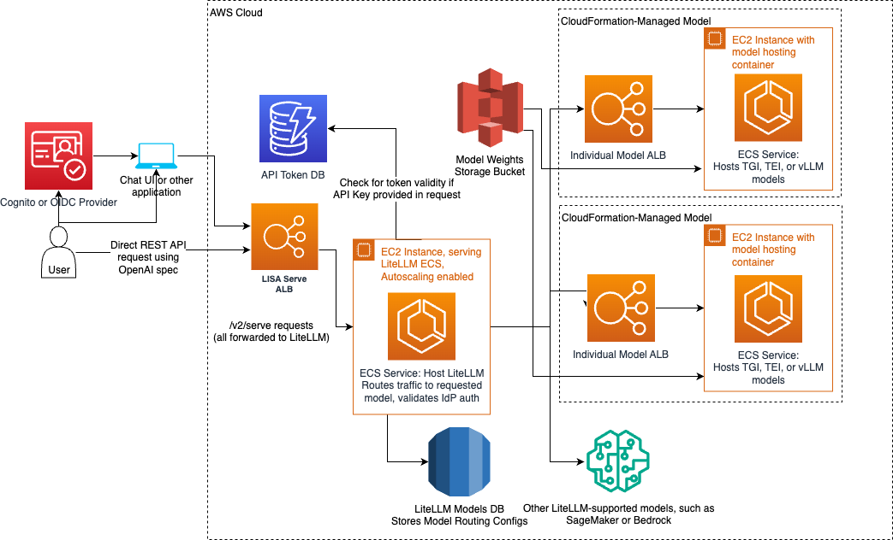

# LLM inference solution for Amazon Dedicated Cloud (LISA)

LISA is an enabling service to easily deploy generative AI applications in AWS customer environments. LISA is an infrastructure-as-code solution. It allows customers to provision their own infrastructure within an AWS account. Customers then bring their own models to LISA for hosting and inference.
LISA accelerates the use of generative AI applications by providing scalable, low latency access to customers’ generative LLMs and embedding language models. Using LISA to support hosting and inference allows customers to focus on experimenting with LLMs and developing generative AI applications. LISA includes an example chatbot user interface that customers can use to experiment. Also included are retrieval augmented generation (RAG) integrations with Amazon OpenSearch and PGVector. This capability allows customers to bring specialized data to LISA for incorporation into the LLM responses without requiring the model to be retrained.


## Table of contents

- [Background](#background)
- [Get Started](#get-started)
  - [Define Environment Variables](#define-environment-variables)
  - [Setting Up Your Environment](#setup-up-your-environment)
  - [Staging Model Weights](#staging-model-weights)
  - [Customize Configuration](#customize-configuration)
  - [Bootstrap](#bootstrap)
- [Deployment](#deployment)
- [Programmatic API Tokens](#programmatic-api-tokens)
- [Model Compatibility](#model-compatibility)
- [Load Testing](#load-testing)
- [Chatbot Example](#chatbot-example)
- [Usage and Features](#usage-and-features)

## Background

LISA was inspired by another AWS open source project [aws-genai-llm-chatbot](https://github.com/aws-samples/aws-genai-llm-chatbot) and deploys LLMs using the [text-generation-inference](https://github.com/huggingface/text-generation-inference/tree/main) container from HuggingFace. LISA is different from it's inspiration in a few ways:

1.  LISA is designed to operate in Amazon Dedicated Cloud (ADC) partitions.
2.  LISA is designed to be composable so we've separated the the underlying LLM serving capability, this repository contains, LISA-Serve and the chat frontend, LISA-Chat, which are deployable as separate stacks.
3.  LISA is designed to support the OpenAI specification, so anywhere you can use the OpenAI API in your applications, you can insert LISA in its place.

## Deprecation Notes

With the release of the LISA v2.0.0 we have deprecated the v1 endpoint routes in LISA Serve. These routes, such as the `/v1/openai` route, will still work in the current v2 release, but we actively encourage users to migrate to the v2 endpoints
as they will have greater support for listing and using models, along with greater support for the OpenAI API specification.

We intend to fully remove the v1 routes in the next release of LISA, anticipating July 2024.

For users dependent on the v1 OpenAI endpoint, all you have to do to migrate is change your base URL route from `/v1/openai` to `/v2/serve`. Please note that model names may change once you list models again, but this comes with the benefit of being
able to list both models hosted by LISA and models that are configured with the new LiteLLM configuration options.

## Getting Started

LISA leverages AWS's cloud development toolkit (cdk). Users of LISA should be familiar with CDK and infrastructure-as-code principles. If CDK is new to you please see the [documentation on CDK](https://docs.aws.amazon.com/cdk/v2/guide/getting_started.html) and talk to your AWS support team to help get you started.

LISA uses a `make` system that leverages both environment variables and a configuration file. Most of the commands to deploy LISA are wrapped in high level `make` actions, please see [Makefile](./Makefile).

Let's start by downloading the repository:

```
git clone <path-to-lisa-repo>
cd lisa
```

### Define Environment Variables

As we stated earlier you will need to define some parameters in environment though most parameters are provided by the example configuration file, [example_config.yaml](./examle_config.yaml). You'll need to create a copy of that file and name it `config.yaml`. Any deployment specific values should be set in the `config.yaml` file which will be used when running the make commands.

```bash
# you can also leave this blank
export PROFILE=my-aws-profile
# this will prepend the stack name in cloud formation
export DEPLOYMENT_NAME=my-deployment
# the type of deployment likely dev, test or prod
export ENV=dev
```

### Setting Up Your Environment

LISA uses both Python and TypeScript so we need to setup these environments first. These are one time operations and do not need to be repeated each time LISA is deployed from the same developer machine/account. Let's first install Python requirements:

```bash
# required for parsing the Makefile
sudo apt-get install jq
pip3 install yq huggingface_hub s5cmd
make createPythonEnvironment
activate your python environment (command required is output from the previous make command)
make installPythonRequirements
```

Next we can setup the typescript environment.

```bash
make createTypeScriptEnvironment
make installTypeScriptRequirements
```

### Staging Model Weights

All model weights are stored in S3. LISA was built to use your account's S3 bucket and not publicly available model repositories. Here we assume that the s3 bucket is formatted as follows:

```
s3://<bucket-name>/<hf-model-id-1>
s3://<bucket-name>/<hf-model-id-1>/<file-1>
s3://<bucket-name>/<hf-model-id-1>/<file-2>
...
s3://<bucket-name>/<hf-model-id-2>
```

We also will need `.safetensors`. In order to reduce the startup time we will do this ahead of time. A check is run at deploy time to ensure all models have safetensors. You will be provided with the opportunity to convert models without safetensors. Model download and conversion occurs locally, so make sure you have a sufficient space on your disk. On internet connected systems, models will be downloaded via HuggingFace using the provided HuggingFace model ID. On airgapped systems, we expect model artifacts to be downloaded locally and placed in a `models` directory in the project root. Models should be placed in HuggingFace format like `models/<model-id>` where `model-id` is the `/` delimited string `<model org>/<model name>` matching the model card on HuggingFace's model repo.

Note: we have primarily designed and tested this with HuggingFace models in mind. Any models outside of this format will require you to create and upload safetensors manually.

### Identity Provider Configuration

In the config.yaml file, you will find a block for the `authConfig`. This configuration is required for deploying LISA, and it is used for identifying the
OpenID Connect identity provider (IdP) that will be used for authenticating users who want to use LISA features, such as the Chat UI. Common usage patterns
include using Cognito within your AWS Account or using [Keycloak](https://www.keycloak.org/) configured by your organization. The `authConfig` will require
four values and an optional fifth: the `authority`, the `clientId`, the `adminGroup` for writing and updating available models, the `jwtGroupsProperty` which
is the path to the field that contains the list of groups a user is a part of in the returned JWT token ex: `cognito:groups` for cognito or `realm_access.roles`
for Keycloak. The optional property is `additionalScopes` which is a list of extra scopes that might be required to request the needed group membership information.

#### Cognito

In Cognito, the `authority` will be the URL to your User Pool. As an example, if your User Pool ID, not the name, is `us-east-1_example`, and if it is
running in `us-east-1`, then the URL to put in the `authority` field would be `https://cognito-idp.us-east-1.amazonaws.com/us-east-1_example`. The `clientId`
can be found in your User Pool's "App integration" tab from within the AWS Management Console, and at the bottom of the page, you will see the list of clients
and their associated Client IDs. The ID here is what we will need for the `clientId` field.

#### Keycloak

In Keycloak, the `authority` will be the URL to your Keycloak server. The `clientId` is likely not a random string like in the Cognito clients, and instead
will be a string configured by your Keycloak administrator. Your administrator will be able to give you a client name or create a client for you to use for
this application. Once you have this string, use that as the `clientId` within the `authConfig` block.

### LiteLLM Configuration

We utilize LiteLLM under the hood to allow LISA to respond to the [OpenAI specification](https://platform.openai.com/docs/api-reference).
With the models that we are hosted using the process above, we automatically add them to our LiteLLM configuration with
no additional configuration required from the user. We expose the [LiteLLM configuration](https://litellm.vercel.app/docs/proxy/configs)
file directly within the LISA config.yaml file, so any options defined there can be defined directly in the LISA config file, under the `litellmConfig` option.
This also means that we will also support calling other existing models that your VPC configuration allows. For more
information about adding models, please see the LiteLLM docs [here](https://litellm.vercel.app/docs/proxy/configs).

For the LISA implementation, we added one more block under the models within the `model_list` so that we can gather information about your
models for usage in the LISA Chat UI. We ask for whether the model is a `textgen` or `embedding` model, and then if the model is a `textgen`
model, we ask if it supports streaming or not. If the model is an embedding model, then the `streaming` option must be null or omitted.
These fields will allow us to organize the models in the Chat UI so that the models show in
the correct locations. These fields can be seen in the example configuration below.

#### SageMaker Endpoints and Bedrock Models

We do support adding existing SageMaker Endpoints and Bedrock Models to the LiteLLM configuration, and as long as the
services you use are in the same region as the LISA installation, LISA will be able to use those models alongside any
other models you have deployed. After installing LISA without referencing the SageMaker Endpoint, create a SageMaker Model using
the private subnets of the LISA deployment, and that will allow the REST API container to reach out to any Endpoint that
uses that SageMaker Model. Then, to invoke the SageMaker Endpoints or Bedrock Models, you would need to add the following
permissions to the "REST-Role" that was created in the IAM stack:

```
"bedrock:InvokeModel",
"bedrock:InvokeModelWithResponseStream",
"sagemaker:InvokeEndpoint",
"sagemaker:InvokeEndpointWithResponseStream"
```

After adding those permissions and access in the VPC, LiteLLM will now be able to route traffic to those entities, and
they will be accessible through the LISA ALB, using the OpenAI specification for programmatic access.

#### Recommended Configuration Options

There is no one-size-fits-all configuration, especially when it comes to invoking models whose infrastructure is defined outside
the scope of LISA, but we do recommend the following settings for a minimal setup to invoke those existing models. The following example
assumes a SageMaker Endpoint called "test-endpoint," access to the "amazon.titan-text-express-v1" Bedrock Model, a self-hosted OpenAI-compatible
text generation model with an endpoint you can access from the VPC, and a similarly configured embedding model. The SageMaker Endpoint and
Bedrock Model must be in the same region as the LISA installation.

```yaml
dev:
  litellmConfig:
    litellm_settings:
      telemetry: false # Don't attempt to send telemetry to LiteLLM servers from within VPC
      drop_params: true # Don't fail if params not recognized, instead ignore unrecognized params
    model_list:
      - model_name: test-endpoint # Human-readable name, can be anything and will be used for OpenAI API calls
        litellm_params:
          model: sagemaker/test-endpoint # Prefix required for SageMaker Endpoints and "test-endpoint" matches Endpoint name
          api_key: ignored # Provide an ignorable placeholder key to avoid LiteLLM deployment failures
        lisa_params:
          model_type: textgen
          streaming: true

      - model_name: bedrock-titan-express # Human-readable name for future OpenAI API calls
        litellm_params:
          model: bedrock/amazon.titan-text-express-v1 # Prefix required for Bedrock Models, and exact name of Model to use
          api_key: ignored # Provide an ignorable placeholder key to avoid LiteLLM deployment failures
        lisa_params:
          model_type: textgen
          streaming: true

      - model_name: custom-openai-model # Used in future OpenAI-compatible calls to LiteLLM
        litellm_params:
          model: openai/modelProvider/modelName # Prefix required for OpenAI-compatible models followed by model provider and name details
          api_base: https://your-domain-here:443/v1 # Your model's base URI
          api_key: ignored # Provide an ignorable placeholder key to avoid LiteLLM deployment failures
        lisa_params:
          model_type: textgen
          streaming: true

      - model_name: custom-openai-embedding-model # Used in future OpenAI-compatible calls to LiteLLM
        litellm_params:
          model: openai/modelProvider/modelName # Prefix required for OpenAI-compatible models followed by model provider and name details
          api_base: https://your-domain-here:443/v1 # Your model's base URI
          api_key: ignored # Provide an ignorable placeholder key to avoid LiteLLM deployment failures
        lisa_params:
          model_type: embedding
```

### DEV ONLY: Create Self-Signed Certificates for ALB

**WARNING: THIS IS FOR DEV ONLY**

When deploying for dev and testing you can use a self-signed certificate for the REST API ALB. You can create this by using the script: `gen-cert.sh` and uploading it to `IAM`.

```
export REGION=<region>
./scripts/gen-certs.sh
aws iam upload-server-certificate --server-certificate-name <certificate-name> --certificate-body file://scripts/server.pem --private-key file://scripts/server.key
```

And you will need to update the ALB certificate path in the config.yaml file:

```yaml
restApiConfig:
  loadBalancerConfig:
    sslCertIamArn: arn:aws:iam::<account-number>:server-certificate/<certificate-name>
```

### Customize Configuration

The [config.yaml](./config.yaml) file has many parameters and many of them can be left as defaults but it's important to discuss a few key ones.

#### Models To Be Deployed

The configuration file will determine which models are deployed. In order to deploy an additional model or a different model the only required change is to the configuration file, as long as it is compatible with the inference container. Specifically, see the `ecsModels` section of the [config.yaml](./config.yaml) file:

```yaml
  ecsModels:
    - modelName: falcon-40b-instruct
      deploy: true
      instanceType: g4dn.12xlarge
      modelType: textgen
      inferenceContainer: tgi
      containerConfig:
        baseImage: ghcr.io/huggingface/text-generation-inference:1.0.2
        ...
```

Here we define the model name, if we want to deploy, the type of instance we want to deploy to, the type of model (textgen or embedding), the inference container and then the containerConfig. There are many more parameters for the ecs models, many for autoscaling and health checks. However, let's focus on the model specific ones:

```yaml
environment:
  QUANTIZE: bitsandbytes-nf4
  MAX_CONCURRENT_REQUESTS: 128
  MAX_INPUT_LENGTH: 1024
  MAX_TOTAL_TOKENS: 2048
```

These parameters will be used when the model endpoint is deployed and are likely to change with different model types. For more information on these parameters please see the [inference container documentation](https://github.com/huggingface/text-generation-inference/tree/main).

### Bootstrap

If you have not bootstrapped your account for CDK you must first do so. If you have move on to the next stage.

```
make bootstrap
```

## Deployment

### Using pre-built resources

A default configuration will build the necessary containers, lambda layers, and production optimized
web application at build time. In the event that you would like to use pre-built resources due to
network connectivity reasons or other concerns with the environment where you'll be deploying LISA
you can do so.

- For ECS containers (Models, APIs, etc) you can modify the `containerConfig` block of
  the corresponding entry in `config.yaml`. For container images you can provide a path to a directory
  from which a docker container will be built (default), a path to a tarball, an ECR repository arn and
  optional tag, or a public registry path.
  - We provide immediate support for HuggingFace TGI and TEI containers and for vLLM containers. The `example_config.yaml`
    file provides examples for TGI and TEI, and the only difference for using vLLM is to change the
    `inferenceContainer`, `baseImage`, and `path` options, as indicated in the snippet below. All other options can
    remain the same as the model definition examples we have for the TGI or TEI models. vLLM can also support embedding
    models in this way, so all you need to do is refer to the embedding model artifacts and remove the `streaming` field
    to deploy the embedding model.
  - vLLM has support for the OpenAI Embeddings API, but model support for it is limited because the feature is new. Currently,
    the only supported embedding model with vLLM is [intfloat/e5-mistral-7b-instruct](https://huggingface.co/intfloat/e5-mistral-7b-instruct),
    but this list is expected to grow over time as vLLM updates.
    ```yaml
    ecsModels:
      - modelName: mistralai/Mistral-7B-Instruct-v0.2
        modelId: mistral7b-vllm
        deploy: true
        modelType: textgen # can also be 'embedding'
        streaming: true # remove option if modelType is 'embedding'
        instanceType: g5.xlarge
        inferenceContainer: vllm # vLLM-specific config
        containerConfig:
          image:
            baseImage: vllm/vllm-openai:v0.5.0 # vLLM-specific config
            path: lib/serve/ecs-model/vllm # vLLM-specific config
    ```
- If you are deploying the LISA Chat User Interface you can optionally specify the path to the pre-built
  website assets using the top level `webAppAssetsPath` parameter in `config.yaml`. Specifying this path
  (typically `lib/user-interface/react/dist`) will avoid using a container to build and bundle the assets
  at CDK build time.
- For the lambda layers you can specify the path to a local zip archive of the layer code by including
  the optional `lambdaLayerAssets` block in `config.yaml` similar to the following:

```
lambdaLayerAssets:
  authorizerLayerPath: lib/core/layers/authorizer_layer.zip
  commonLayerPath: lib/core/layers/common_layer.zip
  fastapiLayerPath: /path/to/fastapi_layer.zip
  sdkLayerPath: lib/rag/layers/sdk_layer.zip
```

### Deploying

Now that we have everything setup we are ready to deploy.

```bash
make deploy
```

By default, all stacks will be deployed but a particular stack can be deployed by providing the `STACK` argument to the `deploy` target.

```bash
make deploy STACK=LisaServe
```

Available stacks can be listed by running:

```bash
make listStacks
```

After the `deploy` command is run, you should see many docker build outputs and eventually a CDK progress bar. The deployment should take about 10-15 minutes and will produce a single cloud formation output for the websocket URL.

You can test the deployment with the integration test:

```bash
pytest lisa-sdk/tests --url <rest-url-from-cdk-output> --verify <path-to-server.crt> | false
```

## Programmatic API Tokens

The LISA Serve ALB can be used for programmatic access outside the example Chat application.
An example use case would be for allowing LISA to serve LLM requests that originate from the [Continue VSCode Plugin](https://www.continue.dev/).
To facilitate communication directly with the LISA Serve ALB, a user with sufficient DynamoDB PutItem permissions may add
API keys to the APITokenTable, and once created, a user may make requests by including the `Authorization: Bearer ${token}`
header or the `Api-Key: ${token}` header with that token. If using any OpenAI-compatible library, the `api_key` fields
will use the `Authorization: Bearer ${token}` format automatically, so there is no need to include additional headers
when using those libraries.

### Adding a Token

An account owner may create a long-lived API Token using the following AWS CLI command.

```bash
AWS_REGION="us-east-1"  # change to your deployment region
token_string="YOUR_STRING_HERE"  # change to a unique string for a user
aws --region $AWS_REGION dynamodb put-item --table-name $DEPLOYMENT_NAME-LISAApiTokenTable \
    --item '{"token": {"S": "'${token_string}'"}}'
```

If an account owner wants the API Token to be temporary and expire after a specific date, LISA will allow for this too.
In addition to the `token` field, the owner may specify the `tokenExpiration` field, which accepts a UNIX timestamp,
in seconds. The following command shows an example of how to do this.

```bash
AWS_REGION="us-east-1"  # change to your deployment region
token_string="YOUR_STRING_HERE"
token_expiration=$(echo $(date +%s) + 3600 | bc)  # token that expires in one hour, 3600 seconds
aws --region $AWS_REGION dynamodb put-item --table-name $DEPLOYMENT_NAME-LISAApiTokenTable \
    --item '{
        "token": {"S": "'${token_string}'"},
        "tokenExpiration": {"N": "'${token_expiration}'"}
    }'
```

Once the token is inserted into the DynamoDB Table, a user may use the token in the `Authorization` request header like
in the following snippet.

```bash
lisa_serve_rest_url="https://<rest-url-from-cdk-output>"
token_string="YOUR_STRING_HERE"
curl ${lisa_serve_rest_url}/v2/serve/models \
    -H 'accept: application/json' \
    -H 'Content-Type: application/json' \
    -H "Authorization: Bearer ${token_string}"
```

### Updating a Token

In the case that an owner wishes to change an existing expiration time or add one to a key that did not previously have
an expiration, this can be accomplished by editing the existing item. The following commands can be used as an example
for updating an existing token. Setting the expiration time to a time in the past will effectively remove access for
that key.

```bash
AWS_REGION="us-east-1"  # change to your deployment region
token_string="YOUR_STRING_HERE"
token_expiration=$(echo $(date +%s) + 600 | bc)  # token that expires in 10 minutes from now
aws --region $AWS_REGION dynamodb update-item --table-name $DEPLOYMENT_NAME-LISAApiTokenTable \
    --key '{"token": {"S": "'${token_string}'"}}' \
    --update-expression 'SET tokenExpiration=:t' \
    --expression-attribute-values '{":t": {"N": "'${token_expiration}'"}}'
```

### Removing a Token

Tokens will not be automatically removed even if they are no longer valid. An owner may remove an key, expired or not,
from the database to fully revoke the key, by deleting the item. As an example, the following commands can be used to
remove a token.

```bash
AWS_REGION="us-east-1"  # change to your deployment region
token_string="YOUR_STRING_HERE"  # change to the token to remove
aws --region $AWS_REGION dynamodb delete-item --table-name $DEPLOYMENT_NAME-LISAApiTokenTable \
    --key '{"token": {"S": "'${token_string}'"}}'
```

## Model Compatibility

### HuggingFace Generation Models

For generation models, or causal language models, LISA supports models that are supported by the underlying serving container, TGI. TGI divides compatibility into two categories: optimized models and best effort supported models. The list of optimized models is found [here](https://huggingface.co/docs/text-generation-inference/supported_models). The best effort uses the `transformers` codebase under-the-hood and so should work for most causal models on HuggingFace:

```python
AutoModelForCausalLM.from_pretrained(<model>, device_map="auto")
```

or

```python
AutoModelForSeq2SeqLM.from_pretrained(<model>, device_map="auto")
```

### HuggingFace Embedding Models

Embedding models often utilize custom codebases and are not as uniform as generation models. For this reason you will likely need to create a new `inferenceContainer`. Follow the [example](./lib/ecs-model/embedding/instructor) provided for the `instructor` model.

### vLLM Models

In addition to the support we have for the TGI and TEI containers, we support hosting models using the [vLLM container](https://docs.vllm.ai/en/latest/). vLLM abides by the OpenAI specification, and as such allows both text generation and embedding on the models that vLLM supports.
See the [deployment](#deployment) section for details on how to set up the vLLM container for your models. Similar to how the HuggingFace containers will serve safetensor weights downloaded from the
HuggingFace website, vLLM will do the same, and our configuration will allow you to serve these artifacts automatically. vLLM does not have many supported models for embeddings, but as they become available,
LISA will support them as long as the vLLM container version is updated in the config.yaml file and as long as the model's safetensors can be found in S3.

## Chatbot Example


This repository include an example chatbot web application. The react based web application can be optionally deployed to demonstrate the capabilities of LISA Serve. The chatbot consists of a static react based single page application hosted via API GW S3 proxy integration. The app connects to the LISA Serve REST API and an optional RAG API. The app integrates with an OIDC compatible IdP and allows users to interact directly with any of the textgen models hosted with LISA Serve. If the optional RAG stack is deployed then users can also leverage the embeddings models and AWS OpenSearch or PGVector to demonstrate chat with RAG. Chat sessions are maintained in dynamodb table and a number of parameters are exposed through the UI to allow experimentation with various parameters including prompt, temperature, top k, top p, max tokens, and more.

## Local development

### Configuring Pre-Commit Hooks

To ensure code quality and consistency, this project uses pre-commit hooks. These hooks are configured to perform checks, such as linting and formatting, helping to catch potential issues early. These hooks are run automatically on each push to a remote branch but if you wish to run them locally before each commit, follow these steps:

1. Install pre-commit: `pip install pre-commit`
2. Install the git hook scripts: `pre-commit install`

The hooks will now run automatically on changed files but if you wish to test them against all files, run the following command: `pre-commit run --all-files`.

### Run REST API locally

```
cd lib/serve/rest-api
pip install -r src/requirements.txt
export AWS_REGION=<Region where LISA is deployed>
export AUTHORITY=<IdP Endpoint>
export CLIENT_ID=<IdP Client Id>
export REGISTERED_MODELS_PS_NAME=<Models ParameterName>
export TOKEN_TABLE_NAME="<deployment prefix>/LISAApiTokenTable"
gunicorn -k uvicorn.workers.UvicornWorker -w 2 -b "0.0.0.0:8080" "src.main:app"
```

### Run example chatbot locally

Create `lib/user-interface/react/public/env.js` file with the following contents:

```
window.env = {
  AUTHORITY: '<Your IdP URL here>',
  CLIENT_ID: '<Your IdP Client Id Here>',
  JWT_GROUPS_PROP: '<The full path (period delimited) to the property for the groups that a user is a member of in the JWT token. For Cognito: cognito:groups>',
  ADMIN_GROUP: '<The admin group you would like LISA to check the JWT token for>',
  CUSTOM_SCOPES:[<add your optional list of custom scopes to pull groups from your IdP here>],
  // Alternatively you can set this to be your REST api elb endpoint
  RESTAPI_URI: 'http://localhost:8080/',
  RESTAPI_VERSION: 'v2',
  SESSION_REST_API_URI: '<API GW session endpoint>',
  "MODELS": [
    {
      "model": "streaming-textgen-model",
      "streaming": true,
      "modelType": "textgen"
    },
    {
      "model": "non-streaming-textgen-model",
      "streaming": false,
      "modelType": "textgen"
    },
    {
      "model": "embedding-model",
      "streaming": null,
      "modelType": "embedding"
    }
  ]
}
```

Launch the Chat UI:

```
cd lib/user-interface/react/
npm run dev
```

## Usage and Features

The LISA Serve endpoint can be used independently of the Chat UI, and the following shows a few examples of how to do that. The Serve endpoint
will still validate user auth, so if you have a Bearer token from the IdP configured with LISA, we will honor it, or if you've set up an API
token using the [DynamoDB instructions](#programmatic-api-tokens), we will also accept that. This diagram shows the LISA Serve components that
would be utilized during direct REST API requests.



### OpenAI Specification Compatibility

We now provide greater support for the [OpenAI specification](https://platform.openai.com/docs/api-reference) for model inference and embeddings.
We utilize LiteLLM as a proxy for both models we spin up on behalf of the user and additional models configured through the config.yaml file, and because of that, the
LISA REST API endpoint allows for a central location for making text generation and embeddings requests. We support, and are not limited to, the following popular endpoint
routes as long as your underlying models can also respond to them.

- /models
- /chat/completions
- /completions
- /embeddings

By supporting the OpenAI spec, we can more easily allow users to integrate their collection of models into their LLM applications and workflows. In LISA, users can authenticate
using their OpenID Connect Identity Provider, or with an API token created through the DynamoDB token workflow as described [here](#programmatic-api-tokens). Once the token
is retrieved, users can use that in direct requests to the LISA Serve REST API. If using the IdP, users must set the 'Authorization' header, otherwise if using the API token,
users can set either the 'Api-Key' header or the 'Authorization' header. After that, requests to `https://${lisa_serve_alb}/v2/serve` will handle the OpenAI API calls. As an example, the following call can list all
models that LISA is aware of, assuming usage of the API token. If you are using a self-signed cert, you must also provide the `--cacert $path` option to specify a CA bundle to trust for SSL verification.

```shell
curl -s -H 'Api-Key: your-token' -X GET https://${lisa_serve_alb}/v2/serve/models
```

If using the IdP, the request would look like the following:

```shell
curl -s -H 'Authorization: Bearer your-token' -X GET https://${lisa_serve_alb}/v2/serve/models
```

When using a library that requests an OpenAI-compatible base_url, you can provide `https://${lisa_serve_alb}/v2/serve` here. All of the OpenAI routes will
automatically be added to the base URL, just as we appended `/models` to the `/v2/serve` route for listing all models tracked by LISA.

#### Continue JetBrains and VS Code Plugin

For developers that desire an LLM assistant to help with programming tasks, we support adding LISA as an LLM provider for the [Continue plugin](https://www.continue.dev).
To add LISA as a provider, open up the Continue plugin's `config.json` file and locate the `models` list. In this list, add the following block, replacing the placeholder URL
with your own REST API domain or ALB. The `/v2/serve` is required at the end of the `apiBase`. This configuration requires an API token as created through the [DynamoDB workflow](#programmatic-api-tokens).

```json
{
  "model": "AUTODETECT",
  "title": "LISA",
  "apiBase": "https://<lisa_serve_alb>/v2/serve",
  "provider": "openai",
  "apiKey": "your-api-token" // pragma: allowlist-secret
}
```

Once you save the `config.json` file, the Continue plugin will call the `/models` API to get a list of models at your disposal. The ones provided by LISA will be prefaced
with "LISA" or with the string you place in the `title` field of the config above. Once the configuration is complete and a model is selected, you can use that model to
generate code and perform AI assistant tasks within your development environment. See the [Continue documentation](https://docs.continue.dev/how-to-use-continue) for more
information about its features, capabilities, and usage.

#### Usage in LLM Libraries

If your workflow includes using libraries, such as [LangChain](https://python.langchain.com/v0.2/docs/introduction/) or [OpenAI](https://github.com/openai/openai-python),
then you can place LISA right in your application by changing only the endpoint and headers for the client objects. As an example, using the OpenAI library, the client would
normally be instantiated and invoked with the following block.

```python
from openai import OpenAI

client = OpenAI(
  api_key="my_key" # pragma: allowlist-secret not a real key
)
client.models.list()
```

To use the models being served by LISA, the client needs only a few changes:

1. Specify the `base_url` as the LISA Serve ALB, using the /v2/serve route at the end, similar to the apiBase in the [Continue example](#continue-jetbrains-and-vs-code-plugin)
2. Add the API key that you generated from the [token generation steps](#programmatic-api-tokens) as your `api_key` field.
3. If using a self-signed cert, you must provide a certificate path for validating SSL. If you're using an ACM or public cert, then this may be omitted.
   1. We provide a convenience function in the `lisa-sdk` for generating a cert path from an IAM certificate ARN if one is provided in the `RESTAPI_SSL_CERT_ARN` environment variable.

The Code block will now look like this and you can continue to use the library without any other modifications.

```python
# for self-signed certificates
import boto3
from lisapy.utils import get_cert_path
# main client library
from openai import DefaultHttpxClient, OpenAI

iam_client = boto3.client("iam")
cert_path = get_cert_path(iam_client)

client = OpenAI(
  api_key="my_key", # pragma: allowlist-secret not a real key
  base_url="https://<lisa_serve_alb>/v2/serve",
  http_client=DefaultHttpxClient(verify=cert_path), # needed for self-signed certs on your ALB, can be omitted otherwise
)
client.models.list()
```

## License Notice

Although this repository is released under the Apache 2.0 license, when configured to use PGVector as a RAG store it uses
the third party `psycopg2-binary` library. The `psycopg2-binary` project's licensing includes the [LGPL with exceptions](https://github.com/psycopg/psycopg2/blob/master/LICENSE) license.
