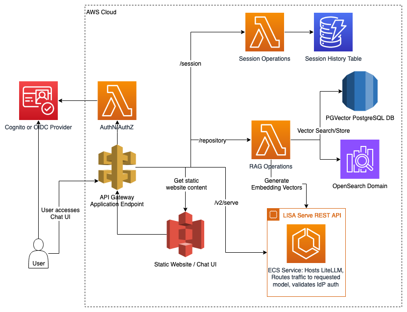

# Architecture Overview

LISA’s four major components include Serve, a Chat user interface (UI), retrieval augmented generation (RAG), and model context protocol (MCP).

LISA Serve and LISA MCP are standalone, core solutions with APIs for customers not leveraging LISA’s Chat UI. Both LISA’s Chat UI and RAG are optional components, but must be used with Serve.

* **Serve:** LISA’s foundational, core component offering centralized model orchestration and inference. Through LiteLLM, Serve is compatible with 100+ models hosted by external model providers like Amazon Bedrock and Jumpstart. Serve also supports secure model self-hosting in scalable Amazon ECS clusters.
* **Chat UI:** LISA’s configurable UI supports customers prompting LLMs, creating and sharing prompt templates, leveraging RAG and MCP capabilities, comparing model responses, and managing chat session history. Administrators can manage advanced features, configure resources through wizards to manage models, RAG repositories, document ingestion pipelines, and MCP servers. Administrators configure Chat with an identity provider (IdP) to manage user access. Enterprise groups can then be associated with resources to manage access to: models, Amazon Guardrails, RAG repositories, RAG collections, and MCP tools. The chat UI must be used with Serve.
* **RAG:** LISA is compatible with Amazon OpenSearch, Amazon Bedrock Knowledge Bases, and PostgreSQL's PGVector extension in Amazon RDS. LISA offers document ingestion with LangChain along with automated pipelines for customers to routinely load files into their repositories and collections. RAG must be used with Serve.
* **MCP:** LISA’s core component offering scalable MCP server self-hosting. It supports hosting STDIO, HTTP, and SSE servers in AWS Fargate (via Amazon Elastic Container Service or ECS) clusters with custom or prebuilt images. LISA MCP also supports importing custom resources for hosting via S3. LISA MCP can be deployed alongside Serve or independently.
* **APIs:** Customers leveraging LISA Serve for model orchestration and hosting, or LISA MCP for tool hosting can opt to securely integrate directly with mission tooling or alternative front ends. LISA uses Amazon DynamoDB to store Tokens to interact with the exposed APIs.
  * Inference requests through LiteLLM support prompting LLMs configured with LISA. Prompts include LISA’s RAG and MCP features.
  * Chat session API supports session history, conversation continuity and management.
  * Model management API supports deploying, updating, and deleting third party and internally hosted models.
  * MCP API supports deploying, updating, deleting, and calling internally hosted MCP tools.

## LISA Serve

LISA Serve provides model self-hosting and integration with compatible external model providers. Serve supports text generation, image generation, and embedding models. Serve’s components are designed for scale and reliability. Serve can be accessed via LISA’s REST APIs, or through LISA’s chat
UI. Regardless of origin, all inference requests are routed via an Application Load Balancer (ALB), which serves as the main entry point to LISA Serve. The ALB forwards requests through the LiteLLM proxy, hosted in its own scalable Amazon Elastic Container Service (ECS) cluster with Amazon Elastic Compute Cloud (EC2) instance. LiteLLM routes traffic to the appropriate model.

Self-hosted model traffic is directed to model specific ALBs, which enable autoscaling in the event of heavy traffic. Each self-hosted model has its own Amazon ECS cluster and Amazon EC2 instance. Text generation and image generation models compatible with Hugging Face’s
[Text Generation Inference (TGI)](https://huggingface.co/docs/text-generation-inference/en/index) and
[vLLM](https://docs.vllm.ai/en/latest/) images are supported. Embedding models compatible with Hugging Face’s
[Text Embedding Inference (TEI)](https://huggingface.co/docs/text-embeddings-inference/en/index) and
[vLLM](https://docs.vllm.ai/en/latest/) images are also supported. LISA uses Amazon S3 for loading the model weights.

**Technical Notes:**

* RAG operations are managed through `lambda/rag/lambda_functions.py`, which handles embedding generation and document retrieval via OpenSearch and PostgreSQL.
* Direct requests to the LISA Serve ALB entrypoint must utilize the OpenAI API spec, which we support through the use of the LiteLLM proxy.
* LISA supports OpenAI's API spec, which means LISA can be easily configured with the Continue plugin for use with Jetbrains or VS Code integrated development environments (IDE).

### Model Management

Use Model Management for managing the entire lifecycle of models configured or hosted with LISA. This includes creation, updating,
deletion of models deployed on ECS or third party provided. LISA handles scaling of these operations, ensuring that the
underlying infrastructure is managed efficiently.

**Self-Hosted Models:** Models are containerized and deployed on AWS ECS. This design allows models to be independently
scaled based on demand. Traffic to the models is balanced using Application Load Balancers (ALBs), ensuring that the
autoscaling mechanism reacts to load fluctuations in real time, optimizing both performance and availability.

**External Model Routing:** LISA utilizes the LiteLLM proxy to route traffic to different model providers, no matter
their API and payload format. Administrators may configure models hosted by external providers, such as Amazon Bedrock,
to LISA. LISA will add the configuration to LiteLLM without creating any additional supporting infrastructure. Customers
do not have to independently manage each model’s unique API integration.

**Model Lifecycle Management:** AWS Step Functions are used to orchestrate the lifecycle of models, handling the creation,
update, and deletion workflows. Each workflow provisions the required resources using CloudFormation templates, which
manage infrastructure components like EC2 instances, security groups, and ECS services. LISA ensures that the necessary
security, networking, and infrastructure components are automatically deployed and configured.

* The CloudFormation stacks define essential resources using the LISA core VPC configuration, ensuring best practices for
  security and access across all resources in the environment.
* DynamoDB stores model metadata, while Amazon S3 securely manages model weights, enabling ECS instances to retrieve the
  weights dynamically during deployment.

**Technical Notes:**

* Model Lifecycle: Lifecycle operations such as creation, update, and deletion are executed by Step Functions and backed
  by AWS Lambda in `lambda/models/lambda_functions.py`.
* CloudFormation: Infrastructure components are provisioned using CloudFormation templates, as defined in
  `ecs_model_deployer/src/lib/lisa_model_stack.ts`.
* ECS Cluster: ECS cluster and task definitions are located in `ecs_model_deployer/src/lib/ecsCluster.ts`, with model
  containers specified in `ecs_model_deployer/src/lib/ecs-model.ts`.

## LISA MCP

LISA MCP is a standalone product that provides scalable infrastructure for deploying and hosting Model Context Protocol (MCP) servers. It allows customers to self-host MCP servers for enterprise use. LISA MCP can be deployed independently of LISA Serve or configured to work seamlessly with LISA Serve and the Chat UI.

Each MCP server deployed via LISA MCP is provisioned on AWS Fargate via Amazon ECS, fronted by Application Load Balancers (ALBs) and Network Load Balancers (NLBs), and published through the existing API Gateway. This architecture allows chat sessions to securely invoke MCP tools without leaving your VPC. All routes remain protected by the same API Gateway Lambda authorizer patterns that guards the rest of LISA, ensuring API Keys, IDP lockdown, and JWT group enforcement continue to apply automatically.

**Server Types:** LISA MCP supports all MCP server types:
* **STDIO servers:** Automatically wrapped with `mcp-proxy` and exposed over HTTP on port 8080
* **HTTP servers:** Direct HTTP endpoints using the configured port (default 8000)
* **SSE servers:** Server-Sent Events endpoints for streaming responses

**Networking Architecture:** The networking follows a layered approach:
* **API Gateway** receives MCP traffic on `/mcp/{serverId}` routes
* **Network Load Balancer (NLB)** terminates the API Gateway VPC Link and forwards to the Application Load Balancer
* **Application Load Balancer (ALB)** provides HTTP features including health checks, routing, and load balancing
* **ECS Fargate** hosts the MCP server containers within your VPC using the same subnets and security groups as the MCP API stack

**Lifecycle Management:** AWS Step Functions orchestrate the complete lifecycle of MCP servers, handling creation, update, deletion, start, and stop workflows. Each workflow provisions the required resources using CloudFormation templates, which manage infrastructure components like ECS Fargate services, load balancers, VPC Links, and auto-scaling configurations.

**Key Features:**
* Turn-key hosting for STDIO, HTTP, or SSE MCP servers with a single API/UI workflow
* Dynamic container builds from pre-built images or S3 artifacts synced at deploy time
* Auto-scaling with configurable Fargate min/max capacity, custom metrics, and scaling targets per server
* Secure VPC networking with private ALB for internal traffic and NLB + VPC Link for API Gateway access
* Group-aware routing to limit server visibility to specific identity provider groups or make them public
* External integrations via API Gateway URLs, enabling trusted third-party agents, copilots, or workflow engines to invoke hosted MCP servers using the same credentials and auth controls

**Technical Notes:**

* MCP Server Lifecycle: Lifecycle operations such as create, update, delete, start, and stop are orchestrated by Step Functions workflows (`CreateMcpServer`, `UpdateMcpServer`, `DeleteMcpServer`). The MCP API Handler Lambda validates requests and manages server metadata in DynamoDB.
* CloudFormation: Infrastructure components are provisioned using CloudFormation templates synthesized by the MCP server deployer Lambda, as defined in `mcp_server_deployer/src/lib/ecsMcpServer.ts`.
* ECS Fargate: Each MCP server runs in its own ECS Fargate cluster with dedicated ALB and NLB. The Fargate cluster configuration is located in `mcp_server_deployer/src/lib/ecsFargateCluster.ts`.
* Authentication: API Gateway enforces the same Lambda authorizer used across LISA (JWT validation + optional API key checks). The `{LISA_BEARER_TOKEN}` placeholder in connection details is automatically replaced with the user's bearer token at connection time.
* Data Storage: Server metadata is stored in the `MCP_SERVERS_TABLE` DynamoDB table. When `DEPLOYMENT_PREFIX` is configured, completed servers are published to `McpConnectionsTable` so the chat application can surface them alongside externally hosted connections.

## Chat UI

LISA provides a configurable chat user interface (UI). The UI is hosted as a static website in Amazon S3, and is fronted
by Amazon API Gateway. Customers prompt models and view responses. The UI is integrated with LISA Serve, Chat
APIs, Model Management APIs, and RAG. LISA’s chat UI supports integration with an OIDC identity provider to handle user
authentication. LISA can be accessible to all users, or limited to a single enterprise user group. Users added to the
Administrator role have access to application configuration.

**Features:**

* Prompting text and image generation LLMs and receiving responses
* Viewing, deleting, and exporting chat history
* Supports streaming responses, viewing metadata, RAG citations
* Supports Markdown, mermaid, and math formatting
* Creating and sharing directive prompt and persona templates in a Prompt Library
* Supports advanced model args like max tokens, Top P, Temperature, stop words
* Referencing vector stores for RAG, and doc uploads
* RAG document library
* Uploading docs into non-RAG in context
* Non-RAG in context Document summarization feature
* Model Context Protocol (MCP) support for LISA MCP, along with MCP Workbench, and third party MCP Connections features
* Administrators control which features are available without having to make code changes via the Configuration page
* Administrators configure models with LISA via the model manage wizard in Model Management
* Administrators add and manage vector stores and manage group access, and automatic ingestion pipelines via RAG Management
* Administrators configure hosted MCP Servers via the MCP Management
