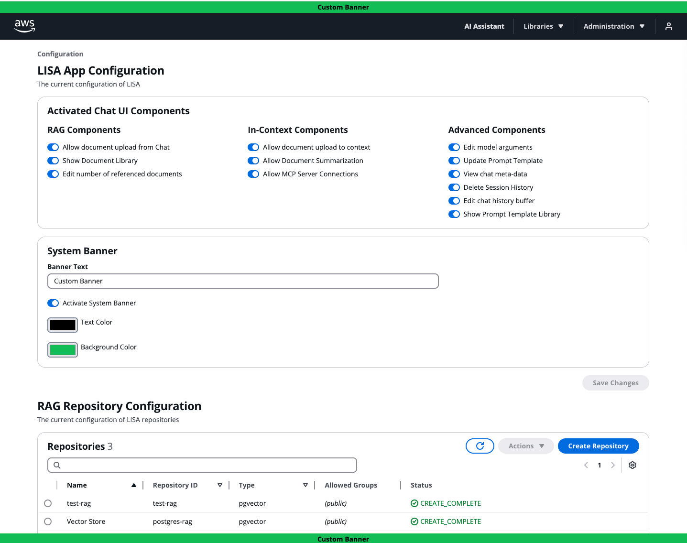

# What is LISA?

The large language model (LLM) inference solution for Amazon Dedicated Cloud (ADC), [LISA](https://github.com/awslabs/LISA),
is an open-source, infrastructure-as-code product. Customers deploy it directly into an Amazon Web Services (AWS)
account. While LISA is specially designed for ADC regions that support government customers' most sensitive workloads,
it is also compatible in any region. LISA is scalable and ready to support production use cases.

LISA accelerates GenAI adoption by offering built-in configurability with [Amazon Bedrock](https://aws.amazon.com/bedrock/) models, Knowledge Bases, and Guardrails. LISA also offers advanced capabilities like an optional enterprise-ready chat user interface (UI) with configurable features, authentication, resource access control, centralized model orchestration via LiteLLM, model self-hosting via Amazon ECS, retrieval augmented generation (RAG), APIs, and broad model context protocol (MCP) support and features. LISA is also compatible with OpenAI’s API specification making it easily configurable with supporting solutions. For example, the Continue plugin for VSCode and JetBrains integrated development environments (IDE).

LISA's roadmap is customer-driven, with new capabilities launching monthly. Reach out to the product team to ask questions, provide feedback, and send feature requests via the "Contact Us" button above.

# Major Features

LISA has four modular components: serve, chat user interface, RAG, and MCP. Major features include:

**Model Flexibility & Orchestration**

LISA’s core component, Serve, provides secure, scalable, low latency access to customers' generative LLMs and embedding
language models. Serve offers model flexibility out of the box. Customers can self-host models directly within LISA
infrastructure, or integrate with compatible third party model providers. LISA supports model self-hosting and inference
via Amazon Elastic Container Service (ECS) with Amazon Elastic Compute Cloud (EC2). Text generation, image generation,
video generation, and embedding models compatible with Hugging Face’s
[Text Generation Inference (TGI)](https://huggingface.co/docs/text-generation-inference/en/index)
and [Text Embedding Inference (TEI)](https://huggingface.co/docs/text-embeddings-inference/en/index) images,
and [vLLM](https://docs.vllm.ai/en/latest/) are supported.

LISA Serve is compatible with 100+ models hosted by external model providers, including Amazon Bedrock and Amazon SageMaker
JumpStart. Serve supports OpenAl's API spec via the [LiteLLM](https://docs.litellm.ai/docs/) proxy, a popular Python
library. LiteLLM standardizes interactions using OpenAl's API format, translating inputs to match each model provider's
unique API requirements. Without model orchestration, customers must individually manage API integrations with each
provider. Customers can securely centralize and standardize communication across these model providers, using LISA as a
model orchestration layer.

**Chat UI**

Through LISA's chat UI, customers securely prompt LLMs, receive responses, create and manage prompt templates, change
model arguments, manage their personal session history, upload files, and access advanced chat features.
Administrators can add, remove, and update models configured with LISA via the model management page. The application
configuration page allows Administrators to control the individual chat features available to customers. These feature
configurations make the chat UI easy to customize without requiring code changes or application re-deployment.
Administrators can also configure vector stores and automate document pipelines to support LISA's retrieval augmented
generation capabilities. Lastly, the chat UI supports integration with an OIDC identity provider to handle user authentication.

**Model Context Protocol (MCP)**

LISA MCP features offer customers flexibility with their agentic workloads. MCP is a popular open standard that enables developers to securely connect AI assistants to systems where data lives. First, customers can configure third party MCP servers with LISA via the MCP Connections feature. Next, Administrators can use LISA Workbench's Python editor to create, test, and deploy custom tools through LISA's hosted MCP server. This is great for rapid prototyping and deployment of custom functionality.

Lastly, LISA MCP is a new stand-alone solution under the LISA umbrella. It can be deployed on its own, or alongside LISA Serve. LISA MCP extends LISA's existing MCP capabilities by offering self-hosting. Customers deploy, self-host, and manage MCP servers in enterprise-grade, scalable infrastructure. Administrators can quickly deploy STDIO, HTTP or SSE MCP servers through a single API call, or intuitive UI workflow. LISA MCP offers automatic scaling policies and secure VPC networking. This ensures traffic never leaves customers’ private network boundaries. LISA MCP supports dynamic container management by allowing customers to bring pre-built container images, or point to Amazon S3 artifacts that are automatically packaged into containers at deployment time. All hosted MCP servers benefit from security controls through API Gateway integration, including authentication, authorization, API keys, IDP lockdown, and JWT group enforcement. Administrative control on each server includes group-based access control, lifecycle automation through Step Functions, and built-in health monitoring at both container and load balancer levels. External integration with LISA MCP hosted servers allows access by agents, copilots, RPA bots, or SaaS workloads using the same secure endpoints.

**Retrieval Augmented Generation (RAG)**

LISA supports RAG through Amazon OpenSearch or PostgreSQL's PGVector extension in Amazon RDS. RAG is the process of
optimizing the output of LLMs by referencing supplemental authoritative information before generating a response.
RAG reduces the need for fine-tuning models, an expensive and time-consuming undertaking. Through LISA's Chat UI,
customers upload files directly into a vector store. Then, the LLM references the vector store to enhance model output,
incorporating contextually relevant information into responses. LISA also supports an automatic document ingestion
pipeline for Administrators to routinely load files into their vector stores.

**APIs**

Customers can configure LISA Serve directly with their existing mission tooling or alternative front ends. LISA offers
APIs to support inference requests and responses, model management, and chat session management. Inference calls can
also include MCP and RAG prompting if configured with LISA.

**CodeGen**

LISA integrates easily with applications compatible with OpenAI's API specification. For instance, customers can
configure LISA as the model provider for the [Continue](https://www.continue.dev/) plugin, an open-source AI code
assistance tool for [JetBrains](https://www.jetbrains.com/) and [Visual Studio Code](https://code.visualstudio.com/)
integrated development environments (IDEs). This enables customers to access any LISA-configured model for LLM prompting
directly within their IDE for code generation. Developers can access all LISA configured models through a single,
centralized programmatic API and authenticate using temporary or long-lived API tokens from their IDE.

# Key Features & Benefits

* Open source with no subscription or licensing fees. Costs are based on service usage.
* Customer driven roadmap with ongoing releases. LISA is backed by a software development team.
* Maximum built-in model flexibility through self-hosting and LiteLLM compatibility, making LISA a two-way door decision.
* Centralized and standardized model orchestration. LISA is LiteLLM compatible allowing easy configuration with 100+
models hosted by external providers, like Amazon Bedrock. LISA standardizes the unique API calls into the OpenAI format
automatically. All that is required is an API key, model name, and API endpoint.
* Complements Amazon Bedrock by supporting its models, and by offering added capabilities out of the box. This includes
a production quality chat user interface with configurable features and authentication, a chat session API,
built in model orchestration, added model flexibility, and model context protocol support.
* Accelerates GenAI adoption with secure, scalable, production ready software. LISA’s modular components and APIs offer
flexibility for different use cases.
* Leverages AWS services that are FedRAMP High compliant.

*The below screenshot showcases LISA’s optional chat assistant user interface. On the left is the user’s Chat History. In the center, the user can start a new chat session and prompt a model. Up top, the user can select from four libraries: Model, Document, Prompt, and MCP Connections. As an Administrator, this user also can access the Administration menu. Here they configure application features and manage available models. See the next screenshot for more details.* *See the next screenshot for more details.*

*The below screenshot showcases LISA’s application feature configuration page. There are also separate configuration pages where Administrators manage RAG repos and collections, document ingestion pipelines, MCP servers, models, and API tokens.*

*The below screenshot showcases LISA’s Model Management page. It is filtered to display the Claude models configured with LISA, although they are hosted by the Amazon Bedrock service. Via LISA’s Model Management page, Administrators configure self-hosted and externally hosted third party (3P) models with LISA. LISA is compatible with over 100 externally hosted models via the LiteLLM proxy. Administrators do not need to worry about the 3P model provider’s unique API requirements since LiteLLM handles the standardization.*

# Access Control

LISA Roles and Enterprise Groups control access to features and resources.

## Roles

`AdminGroup` and `UserGroup` properties in the configuration are used to control tiers of application access, not resource access.

- **AdminGroup**: The IDP group that distinguishes which users have access to create and manage restricted resource configuration within the UI, including:
  - Activating application features
  - Configuring models via Model Management
  - Configuring repos and Collections via RAG management
  - MCP server management
  - MCP Workbench code editor

- **UserGroup** (optional): If provided, this is required when the IDP is used for multiple systems and you want to control which users in the IDP have access to LISA.

- **API Management** (v6.1+): A new role that allows users to manage their API tokens within LISA, but does not grant full Admin privileges.

## Groups

Access to resources can be constrained by Enterprise Groups, including:

- LISA models
- Prompt templates
- RAG repos
- RAG collections
- MCP Connections
- LISA MCP servers
- API tokens

You can create or bring any number of Enterprise Groups in your IDP, which can then be used in LISA to lock down resources at creation/update. When you create/update any resource, you can assign 0, 1, or many Groups to that resource.

### Example: Group-Based Access Control

For example, let's say your IDP has the following groups: **Team Red**, **Team White**, and **Team Blue**. Below shows how you can use Groups to lock down access to Models, and then RAG repos and their Collections:

**Models:**
- Model 1: Teams Red and White
- Model 2: none (Global)
- Model 3: Team Blue

**RAG Repositories and Collections:**
- RAG Repo 1: Teams Red, White, Blue
  - Collection A: Team Red
  - Collection B: Team White
  - Collection C: Teams White and Blue
- RAG Repo 2: none (Global)
  - Collection X: Team Blue
  - Collection Y: none (Global)
