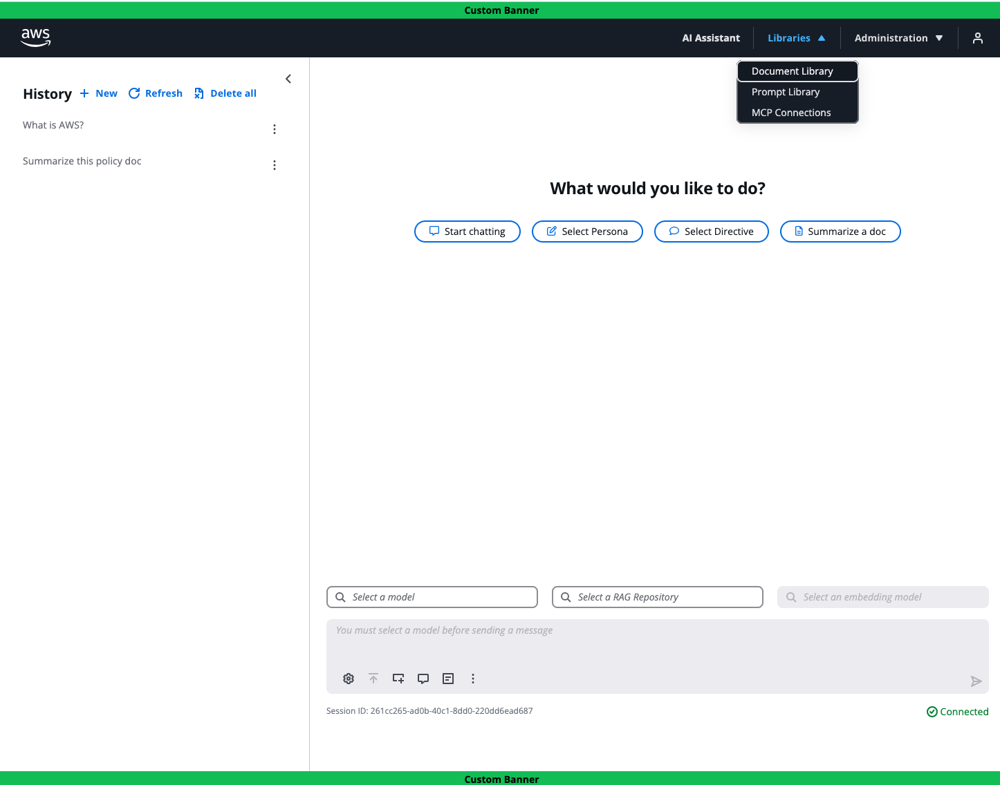
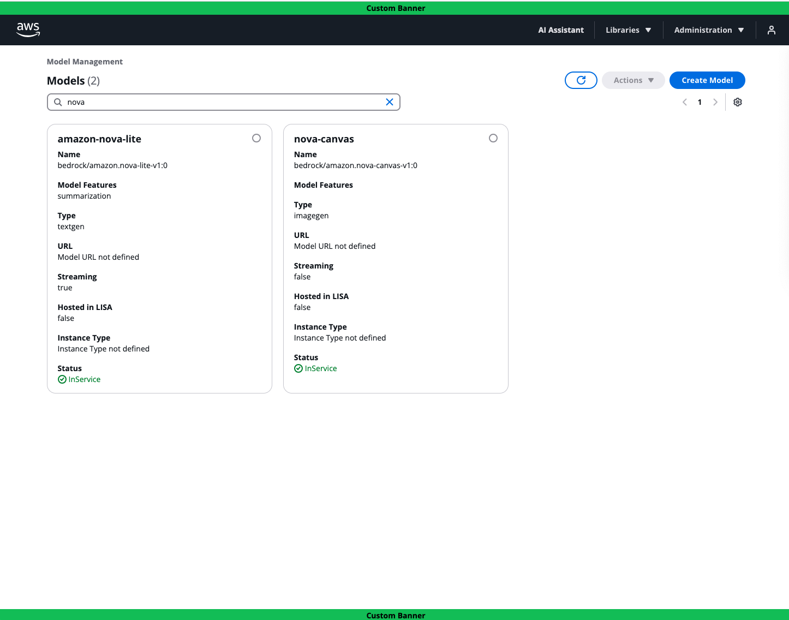

# What is LISA?

The large language model (LLM) inference solution for Amazon Dedicated Cloud (ADC), [LISA](https://github.com/awslabs/LISA),
is an open-source, infrastructure-as-code solution. Customers deploy LISA directly into an Amazon Web Services (AWS)
account. While LISA is specially designed for ADC regions that support government customers' most sensitive workloads,
it is also compatible with commercial regions. LISA compliments [Amazon Bedrock](https://aws.amazon.com/bedrock/) by
supporting built-in configuration with Amazon Bedrock's models and by offering additional capabilities out of the box:
a chat user interface (UI) with configurable features, authentication, centralized model orchestration, broad model
flexibility, and [model context protocol (MCP)](https://modelcontextprotocol.io/introduction) support. LISA is scalable
and ready to support production use cases. LISA's roadmap is customer driven, with capabilities launching monthly.
Reach-out to the LISA product team with questions or feature requests via your AWS Account team or GitHub Issues.

# Major Features

LISA has four main components: serve, chat user interface, retrieval augmented generation (RAG), and APIs.
These capabilities support the following major features.

**Model Flexibility & Orchestration**
LISA’s core component, Serve, provides secure, scalable, low latency access to customers' generative LLMs and embedding
language models. Serve offers model flexibility out of the box. Customers can self-host models directly within LISA
infrastructure, or integrate with compatible third party model providers. LISA supports model self-hosting and inference
via Amazon Elastic Container Service (ECS) with Amazon Elastic Compute Cloud (EC2). Text generation, image generation,
and embedding models compatible with Hugging Face’s
[Text Generation Inference (TGI)](https://huggingface.co/docs/text-generation-inference/en/index)
and [Text Embedding Inference (TEI)](https://huggingface.co/docs/text-embeddings-inference/en/index) images,
and [vLLM](https://docs.vllm.ai/en/latest/) are supported.

LISA Serve is compatible with 100+ models hosted by external model providers, including Amazon Bedrock and Amazon SageMaker
JumpStart. Serve supports OpenAl's API spec via the [LiteLLM](https://docs.litellm.ai/docs/) proxy, a popular Python
library. LiteLLM standardizes interactions using OpenAl's API format, translating inputs to match each model provider's
unique API requirements. Without model orchestration, customers must individually manage API integrations with each
provider. Customers can securely centralize and standardize communication across these model providers, using LISA as a
model orchestration layer.

**Chat UI**
Through LISA's chat UI, customers securely prompt LLMs, receive responses, create and manage prompt templates, change
model arguments, manage their personal session history, upload files, and access advanced chat features.
Administrators can add, remove, and update models configured with LISA via the model management page. The application
configuration page allows Administrators to control the individual chat features available to customers. These feature
configurations make the chat UI easy to customize without requiring code changes or application re-deployment.
Administrators can also configure vector stores and automate document pipelines to support LISA's retrieval augmented
generation capabilities. Lastly, the chat UI supports integration with an OIDC identity provider to handle user authentication.

**Model Context Protocol (MCP)**
LISA supports MCP, a popular open standard that enables developers to securely connect AI assistants to systems where
data lives. Customers can connect MCP servers with LISA and use the tools hosted on that server. For example, if an MCP
server is added to LISA that supports email/calendar actions then LISA customers can prompt for supported tasks. In this
case, customers could request help sending calendar invites on their behalf to specific colleagues based on everyone’s
availability. The LLM would automatically engage the appropriate MCP server tools and perform the necessary steps to
complete the task.

**Retrieval Augmented Generation (RAG)**
LISA supports RAG through Amazon OpenSearch or PostgreSQL's PGVector extension in Amazon RDS. RAG is the process of
optimizing the output of LLMs by referencing supplemental authoritative information before generating a response.
RAG reduces the need for fine-tuning models, an expensive and time-consuming undertaking. Through LISA's Chat UI,
customers upload files directly into a vector store. Then, the LLM references the vector store to enhance model output,
incorporating contextually relevant information into responses. LISA also supports an automatic document ingestion
pipeline for Administrators to routinely load files into their vector stores.

**APIs**
Customers can configure LISA Serve directly with their existing mission tooling or alternative front ends. LISA offers
APIs to support inference requests and responses, model management, and chat session management. Inference calls can
also include MCP and RAG prompting if configured with LISA.

**CodeGen**
LISA integrates easily with applications compatible with OpenAI's API specification. For instance, customers can
configure LISA as the model provider for the [Continue](https://www.continue.dev/) plugin, an open-source AI code
assistance tool for [JetBrains](https://www.jetbrains.com/) and [Visual Studio Code](https://code.visualstudio.com/)
integrated development environments (IDEs). This enables customers to access any LISA-configured model for LLM prompting
directly within their IDE for code generation. Developers can access all LISA configured models through a single,
centralized programmatic API and authenticate using temporary or long-lived API tokens from their IDE.

# Key Features & Benefits

* Open source with no subscription or licensing fees. Costs are based on service usage.
* Customer driven roadmap with ongoing releases. LISA Is backed by a software development team.
* Maximum built-in model flexibility through self-hosting and LiteLLM compatibility, making LISA a two-way door decision.
* Centralized and standardized model orchestration. LISA is LiteLLM compatible allowing easy configuration with 100+
models hosted by external providers, like Amazon Bedrock. LISA standardizes the unique API calls into the OpenAI format
automatically. All that is required is an API key, model name, and API endpoint.
* Compliments Amazon Bedrock by supporting its models, and by offering added capabilities out of the box. This includes
a production quality chat user interface with configurable features and authentication, a chat session API,
built in model orchestration, added model flexibility, and model context protocol support.
* Accelerates GenAI adoption with secure, scalable, production ready software. LISA’s modular components and APIs offer
flexibility for different use cases.
* Leverages AWS services that are FedRAMP High compliant.

*The below screenshot showcases LISA’s optional chat assistant user interface. On the left is the user’s Chat History.
In the center, the user can start a new chat session and prompt a model. Up top, the user can select from three
libraries: Document, Prompt, and MCP Connections. As an Administrator, this user also can access the Administration
menu. Here they configure application features and manage available models.* *See the next screenshot for more details.*

*The below screenshot showcases LISA’s application configuration page. Here Administrators manage application features.
They can set up vector stores and automatic document ingestion pipelines to support RAG.*

*The below screenshot showcases LISA’s Model Management page. It is filtered to display the Amazon Nova models
configured with LISA, although they are hosted by the Amazon Bedrock service. Via LISA’s Model Management page,
Administrators configure self-hosted and externally hosted third party (3P) models with LISA. LISA is compatible with
over 100 externally hosted models via the LiteLLM proxy. Administrators do not need to worry about the 3P model
provider’s unique API requirements since LiteLLM handles the standardization.*

