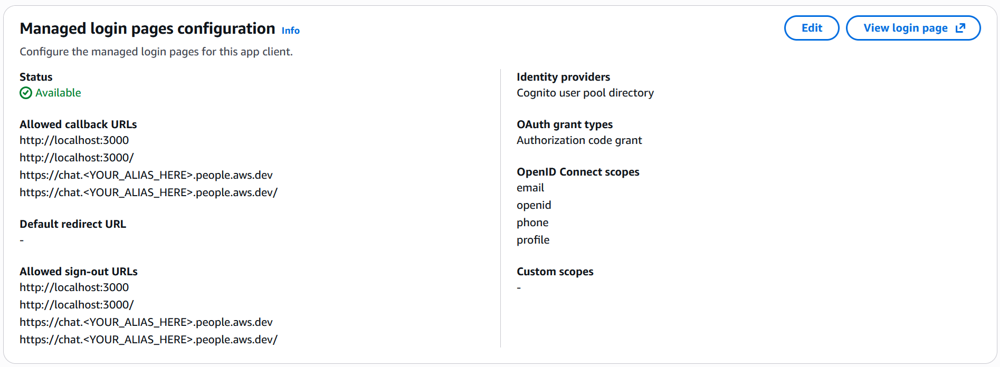

# Example IdP Configurations

## Amazon Cognito

Amazon Cognito is a common choice for authentication with LISA. This section provides detailed setup instructions to ensure proper configuration.

### Creating a Cognito User Pool

When creating a new User Pool for LISA:

1. **Create User Pool**:
   - Navigate to Amazon Cognito in the AWS Console
   - Click "Create user pool"

2. **Create App Client**:
   - **IMPORTANT**: Select **"Single Page Application" (SPA)** as the app type
   - Do NOT use "Traditional Web App" (this will cause authentication failures)

3. **Sign-in Experience**:
   - Select **Username** as a sign-in identifier

4. **Required attributes for sign-up**:
     - `preferred_username` (but disable this in attribute settings)
     - `name`
     - `email`

5. **Disable Self-registration**
   - Uncheck the 'Enable self-registration' box

**We will fill out the return URL later**

### Configuring the App Client

After creating the User Pool and App Client:

1. **Edit App Client Information**:
   - Navigate to your User Pool → App clients
   - Select your app client
   - Click the 'Edit' button in the top right corner
   - Configure **Authentication flows**:
     - Enable: `ALLOW_REFRESH_TOKEN_AUTH`
     - Enable: `ALLOW_USER_SRP_AUTH`
     - Disable all other flows
   - Set **Refresh token expiration** to 30 days (recommended for convenience)
   - Enable **Token revocation**

2. **Configure Hosted UI** (Managed Login Pages):
   - Go back to your selected App Client and go to the 'Login pages' tab
   - Click the 'Edit' button
   - Identity providers:
     - Select: **Cognito user pool directory**
   - OAuth grant types:
     - Select: **Authorization code grant**
   - OpenID Connect scopes:
     - Enable: `email`
     - Enable: `openid`
     - Enable: `phone`
     - Enable: `profile`

3. **Set Callback URLs**:
   - **Allowed callback URLs**:
     - Add your API Gateway URL (dev stage): `https://<api-gateway-url>/dev`
     - Add the same URL with trailing slash: `https://<api-gateway-url>/dev/`
   - **Allowed sign-out URLs**:
     - Use the same URLs as callback URLs
   - **Note**: The callback URLs should point to your LISA API Gateway endpoint, not the REST API ALB

### Image Example
- **Note** you should replace <YOUR_ALIAS_HERE>


### LISA Configuration

If using Amazon Cognito, the `authority` will be the URL to your User Pool. As an example, if your User Pool ID (not
the name) is `us-east-1_example`, and is running in `us-east-1`, then the URL for the `authority` field would be
`https://cognito-idp.us-east-1.amazonaws.com/us-east-1_example`. The `clientId` can be found in your User Pool's
"App integration" tab from within the AWS Management Console. At the bottom of the page you will see the list of
clients and their associated Client IDs. The ID here is what we will need for the `clientId` field.

```yaml
authConfig:
  authority: https://cognito-idp.us-east-1.amazonaws.com/us-east-1_example
  clientId: your-client-id
  adminGroup: AdminGroup
  userGroup: UserGroup
  jwtGroupsProperty: cognito:groups
```

## Troubleshooting Cognito Authentication

#### Sign-in Loop (Continuous Redirect to Login Page)

**Symptom**: Clicking the sign-in button continuously redirects you to the same login page without showing a sign-in form.

**Cause**: Incorrect OpenID Connect scopes configuration.

**Solution**:
- Verify that your App Client has the correct OpenID Connect scopes enabled:
  - `email`
  - `openid`
  - `phone`
  - `profile`
- Ensure OAuth grant type is set to "Authorization code grant"

#### Authentication Token Error (400 Bad Request / Invalid client_secret)

**Symptom**: After signing in, Cognito redirects you back to LISA, but the token exchange fails with a 400 error mentioning `invalid_client` or `client_secret`.

**Cause**: Using "Traditional Web App" instead of "Single Page Application" (SPA) when creating the App Client.

**Solution**:
- Recreate your App Client and select **"Single Page Application" (SPA)** as the app type
- SPA clients do not require a client secret for token exchange, which is correct for browser-based applications

**Testing Tip**: Use Chrome or Firefox Developer Tools:
- Open Developer Tools (F12)
- Navigate to the "Application" tab (Chrome) or "Storage" tab (Firefox)
- Find and clear Cookies related to your Cognito domain
- This allows you to retry the login process with a fresh authentication flow

#### "Contact Your Administrator" Error on Login Page

**Symptom**: The Cognito hosted UI displays an error message asking you to contact your administrator.

**Possible Causes**:
- Incorrect callback URLs in the App Client configuration
- Mismatch between the URL that Cognito is redirecting to and the allowed callback URLs
- The callback URL must exactly match (including trailing slashes)

**Solution**:
- Verify that your App Client's "Allowed callback URLs" include:
  - Your API Gateway dev stage URL: `https://<api-gateway-url>/dev`
  - The same URL with trailing slash: `https://<api-gateway-url>/dev/`
- Ensure the URLs match exactly (check for http vs https, trailing slashes, etc.)
- If the issue persists after correcting the URLs, you may need to redeploy LISA to update the configuration

## Keycloak

If using Keycloak, the `authority` will be the URL to your Keycloak server. The `clientId` is likely not a random string
like in the Cognito clients. Instead, it will be a string configured by your Keycloak Administrator. Your Administrator
will be able to provide you with a client name or create a client for you to use for this application. Once you have this
string, use that as the `clientId` within the `authConfig` block.


```
authConfig:
  authority: https://your-keycloak-server.com
  clientId: your-client-name
  adminGroup: AdminGroup
  userGroup: UserGroup
  jwtGroupsProperty: realm_access.roles
```
