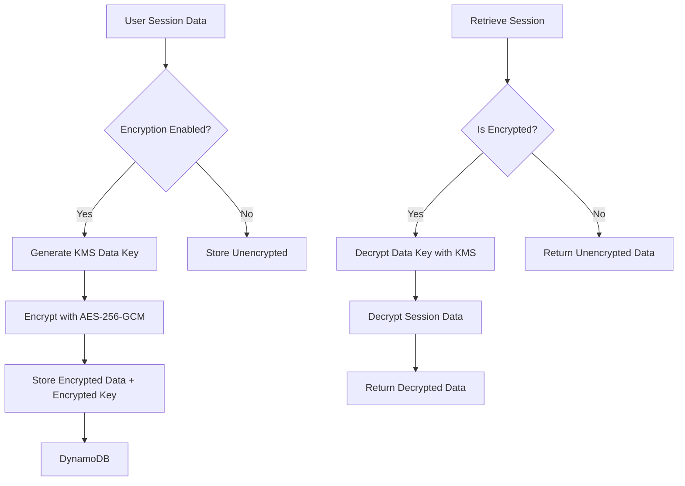

# Session Data Encryption

LISA provides comprehensive session data encryption capabilities to ensure that sensitive chat session data is protected at rest in DynamoDB, preventing unauthorized access even with console access to the database.

## Overview

Session encryption in LISA uses AWS KMS (Key Management Service) with envelope encryption to protect sensitive session data. This implementation provides:

- **Customer-managed encryption keys** with automatic rotation
- **Envelope encryption** using AES-256-GCM
- **Backward compatibility** with existing unencrypted sessions
- **Admin-configurable** encryption settings
- **Client-side encryption support** for enhanced security

## Architecture

### Encryption Flow



### Key Components

1. **KMS Key**: Customer-managed encryption key with automatic rotation
2. **Session API**: Lambda functions handling encryption/decryption
3. **Encryption Utilities**: Python utilities for KMS operations
4. **React Hooks**: Client-side encryption support
5. **Configuration UI**: Admin interface for encryption settings

## Implementation Details

### Server-Side Encryption

The server-side implementation uses AWS KMS envelope encryption:

1. **Data Key Generation**: Generate a unique data key for each session using KMS
2. **Data Encryption**: Encrypt session data using AES-256-GCM with the data key
3. **Key Encryption**: Encrypt the data key using the KMS customer master key
4. **Storage**: Store both encrypted data and encrypted key in DynamoDB

### Client-Side Encryption

The client-side implementation provides additional security by encrypting data before transmission:

1. **Key Generation**: Request data key from server-side KMS
2. **Local Encryption**: Encrypt data using Web Crypto API
3. **Transmission**: Send encrypted data to server
4. **Storage**: Server stores pre-encrypted data

### Data Structure

Encrypted sessions are stored with the following structure:

```json
{
  "sessionId": "session-123",
  "userId": "user-456",
  "name": "My Chat Session",
  "encrypted_history": "base64-encoded-encrypted-data",
  "encrypted_configuration": "base64-encoded-encrypted-data",
  "startTime": "2024-01-01T00:00:00Z",
  "createTime": "2024-01-01T00:00:00Z",
  "lastUpdated": "2024-01-01T00:00:00Z",
  "encryption_version": "1.0",
  "is_encrypted": true
}
```

## Configuration

### Admin Configuration

Session encryption can be configured through the LISA Configuration page:

1. Navigate to **Configuration** in the admin interface
2. Find the **Session Encryption** section
3. Toggle encryption on/off as needed
4. Save changes to apply configuration

### Environment Variables

The following environment variables control encryption behavior:

- `SESSION_ENCRYPTION_ENABLED`: Enable/disable encryption (default: true)
- `SESSION_ENCRYPTION_KEY_ARN`: KMS key ARN for encryption operations

### IAM Permissions

The following IAM permissions are required for session encryption:

```json
{
  "Version": "2012-10-17",
  "Statement": [
    {
      "Effect": "Allow",
      "Action": [
        "kms:GenerateDataKey",
        "kms:Decrypt",
        "kms:DescribeKey"
      ],
      "Resource": "arn:aws:kms:region:account:key/key-id"
    }
  ]
}
```

## Migration Strategy

### Enabling Encryption

When encryption is enabled for the first time:

1. **New Sessions**: All new sessions are automatically encrypted
2. **Existing Sessions**: Remaining unencrypted until accessed
3. **Gradual Migration**: Sessions are encrypted when updated or accessed
4. **Backward Compatibility**: System continues to support unencrypted sessions

### Disabling Encryption

When encryption is disabled:

1. **New Sessions**: Stored without encryption
2. **Existing Encrypted Sessions**: Remain encrypted until accessed
3. **Gradual Migration**: Sessions are decrypted when accessed
4. **Mixed State**: System supports both encrypted and unencrypted sessions

## Security Considerations

### Encryption Context

KMS operations include encryption context for additional security:

```json
{
  "userId": "user-123",
  "sessionId": "session-456",
  "purpose": "session-encryption"
}
```

### Key Rotation

- **Automatic Rotation**: KMS key rotates automatically every 30 days
- **Data Key Rotation**: New data keys generated for each session
- **Backward Compatibility**: Old encrypted data remains accessible

### Access Control

- **User Isolation**: Users can only decrypt their own sessions
- **Admin Controls**: Only administrators can modify encryption settings
- **Audit Logging**: All encryption operations are logged

## API Endpoints

### Session Encryption APIs

- `POST /session/encryption/generate-key`: Generate data key for encryption
- `POST /session/encryption/decrypt-key`: Decrypt data key for decryption
- `GET /session/encryption/config`: Get encryption configuration
- `PUT /session/encryption/config`: Update encryption configuration

### Session Management APIs

- `GET /session/{sessionId}`: Retrieve session (handles encryption automatically)
- `PUT /session/{sessionId}`: Update session (encrypts if enabled)
- `GET /session`: List sessions (shows encryption status)

## Testing

### Unit Tests

Comprehensive unit tests cover:

- Encryption/decryption operations
- KMS integration
- Error handling scenarios
- Backward compatibility
- Migration scenarios

### Integration Tests

Integration tests verify:

- End-to-end encryption flow
- API endpoint functionality
- Configuration management
- Performance impact

## Troubleshooting

### Common Issues

1. **KMS Key Not Found**
   - Verify KMS key ARN is correct
   - Check IAM permissions for KMS access
   - Ensure key is in the correct region

2. **Encryption/Decryption Failures**
   - Check encryption context matches
   - Verify user has access to the session
   - Review CloudWatch logs for detailed errors

3. **Performance Issues**
   - Monitor KMS API call frequency
   - Consider caching data keys for frequently accessed sessions
   - Review DynamoDB read/write capacity

### Monitoring

Key metrics to monitor:

- KMS API call frequency and latency
- Encryption/decryption success rates
- Session access patterns
- Error rates and types

## Best Practices

1. **Key Management**
   - Use customer-managed KMS keys
   - Enable automatic key rotation
   - Monitor key usage and costs

2. **Performance**
   - Cache data keys when possible
   - Monitor KMS API limits
   - Optimize session access patterns

3. **Security**
   - Use encryption context for additional security
   - Regularly audit encryption operations
   - Monitor for unauthorized access attempts

4. **Backup and Recovery**
   - Ensure KMS keys are backed up
   - Test decryption procedures
   - Document recovery processes

## Compliance

Session encryption helps meet various compliance requirements:

- **FedRAMP High**: Enhanced data protection
- **SOC 2**: Data encryption at rest
- **GDPR**: Data protection and privacy
- **HIPAA**: Healthcare data security

## Support

For issues or questions regarding session encryption:

1. Check the troubleshooting section above
2. Review CloudWatch logs for detailed error information
3. Contact your AWS support team for KMS-related issues
4. Open a GitHub issue for LISA-specific problems
