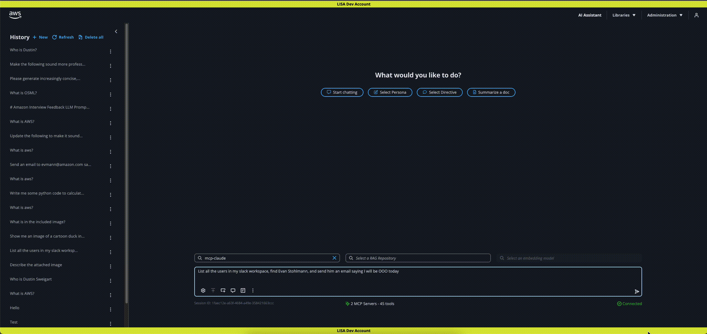

# Model Context Protocol (MCP)

LISA supports Model Context Protocol (MCP), a popular open standard that enables developers to securely connect AI
assistants to systems where data lives. Customers can connect MCP servers with LISA and use the tools hosted on that
server. For example, if an MCP server is added to LISA that supports email/calendar actions then LISA customers can
prompt for supported tasks. In this case, customers could request help sending calendar invites on their behalf to
specific colleagues based on everyone’s availability. The LLM would automatically engage the appropriate MCP server
tools and perform the necessary steps to complete the task.

**Activate MCP Feature & LLM**

1. Administrators must first activate the **MCP Server Connections** feature on LISA’s **Configuration** page. When active, the MCP Connections page will appear under the **Libraries** menu for all LISA users. To activate, toggle **Allow MCP Server Connections** to be active. Click **Save Changes** and then **Update.**
2. An Administrator must add an LLM to support LISA’s MCP tools capability. During model creation in Model Management, toggle **Tool Calls** to be active.

**Add MCP Connections**

Administrators and non-admins can configure MCP server connects with LISA. Non-admins can add MCP server connections for personal use only. However, Administrator can create or update MCP server connections to be available for all LISA users. The steps below demonstrate how to configure LISA with an externally hosted MCP server on the [pipedream](https://mcp.pipedream.com/) platform. To use pipedream MCP servers, you must create an account. This will give you access to MCP server information to use in the below steps.

1. As an Administrator, under the **Libraries** menu select **MCP Connections**.
2. Add at least one MCP server to LISA by clicking on **Create** **MCP Connection** button.
> **TIP:**
>
> Pipedream’s GitHub MCP server is straightforward to implement with LISA and does not require sharing GitHub credentials with pipedream. With the GitHub MCP server, you can prompt the LLM about LISA or MLSpace GitHub repos hosted by AWS Labs. The server will then use its tools to find the repo in GitHub, and gather information. This information will be used by the LLM to answer your prompts.
3. Fill out the required fields to create the MCP server connection: **Name**, **Description**, **URL**.
4. Confirm that this new MCP server connection is **Active**. To activate, toggle **Active** option to be active. This is an Admin only setting that determines if an MCP server connection is generally available for users to opt into using.
> **TIP:**
>
> LISA’s MCP server connections can either be private to a single user, or available to all users. Private MCP server connections created by non-admins are automatically set to Active and only available to that user. Admins can choose to deactivate a user’s private MCP server connection.
5. Click **Create Connection.**
6. Click on the new MCP server connection to view all the tools available on that server.
> **TIP 1:**
>
> MCP server tools are opt out by default. Meaning that an MCP server’s tools are all activated for use in LISA when a new server connection is created. Each user can then choose to personally deactivate specific tools by toggling **Use Tool** to be inactive. This is a user specific setting.

> **TIP 2:**
>
> While individual tools may be active, users cannot access them unless they have opted in to use the parent MCP server connection. This is a user specific setting. See Step 8 below.
7. Use the breadcrumbs at the top of the page to return to the **MCP Connection** list.
8. To use an MCP sever, each user must opt into the MCP server connection in **MCP Connections**. Non-admins can only opt into Active MCP server connections. They will not see Inactive MCP servers. To opt into using an MCP server connection, set the **Use Server** toggle to active in the **MCP Connections** list.
> **TIP:**
>
> MCP server connections are opt in by default. Each user must individually opt in. This is a user specific setting.
9. To confirm configuration, start a new chat session. At the bottom of the page the count of active MCP servers and tools available to this user will display.

**Using MCP tools with LISA**

1. To use an MCP server’s tools, start a new chat session. Click **AI Assistant** at the top of the page.
2. Select the LLM configured previously.
3. Prompt the model to do something supported by the MCP server’s tools configured above.
4. By default, you will be asked to confirm the execution of each tool’s planned external action. See LISA’s Autopilot Mode below for more information. You can also choose to opt out of future confirmation prompts each tool takes.

**MCP Settings: Autopilot Mode, Edit, and Delete**

*Autopilot Mode*

LISA offers optional safeguards with MCP server use. By default, Autopilot Mode is deactivated for each user. As a result, users must approve each external action that MCP tools are planning to execute on their behalf. For example, if a user prompted the model to send an email to a colleague about a follow-up meeting, the MCP tool being used will ask for confirmation before sending an email on behalf of that user. However, a user can choose to manually approve the first action that specific tool takes, and then opt in for auto-approvals for all subsequent tool actions.

When a user activates Autopilot Mode, that user will not be prompted to confirm any MCP tool actions. However, the user will see the actions being executed in the session window. Users always have the ability to manually stop MCP tools via the **Stop generation** button in the bottom right of the chat UI.

> **TIP:**
>
> Each user controls if Autopilot Mode is activated for their personal use. The setting applies to all the server connections that a user has toggled to be in use, indicated by the Use Server toggle activated.

*Edit and Delete*

Admins can edit and delete any MCP Server Connection. Non-admins can edit or delete MCP Server Connections that they created.

