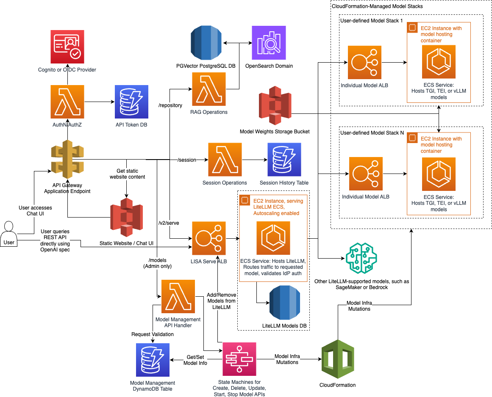

# LLM Inference Solution for Amazon Dedicated Cloud (LISA)

LISA is an infrastructure-as-code solution that supports model hosting and inference. Customers deploy LISA directly
into an AWS account and provision their own infrastructure. Customers bring their own models to LISA for hosting and
inference through Amazon ECS. LISA accelerates the use of Generative AI (GenAI) applications by providing scalable,
low latency access to customers’ generative LLMs and embedding language models. Customers can then focus on
experimenting with LLMs and developing GenAI applications.

LISA’s chatbot user interface can be used for experiment with features and for production use cases. LISA enhances model
output by integrating retrieval-augmented generation (RAG) with Amazon OpenSearch or PostgreSQL’s PGVector extension,
incorporating external knowledge sources into model responses. This helps reduce the need for fine-tuning and delivers
more contextually relevant outputs.

LISA supports OpenAI’s API Spec via the LiteLLM proxy. This means that LISA is compatible for customers to configure
with models hosted externally by supported model providers. LiteLLM also allows customers to use LISA to standardize
model orchestration and communication across model providers instead of managing each individually. With OpenAI API spec
support, LISA can also be used as a stand-in replacement for any application that already utilizes OpenAI-centric
tooling (ex: OpenAI’s Python library, LangChain).

## Background

LISA is a robust, AWS-native platform designed to simplify the deployment and management of Large Language Models (LLMs) in scalable, secure, and highly available environments. Drawing inspiration from the AWS open-source project [aws-genai-llm-chatbot](https://github.com/aws-samples/aws-genai-llm-chatbot), LISA builds on this foundation by offering more specialized functionality, particularly in the areas of security, modularity, and flexibility.

One of the key differentiators of LISA is its ability to leverage the [text-generation-inference](https://github.com/huggingface/text-generation-inference/tree/main) text-generation-inference container from HuggingFace, allowing users to deploy cutting-edge LLMs. LISA also introduces several innovations that extend beyond its inspiration:

1. **Support for Amazon Dedicated Cloud (ADC):** LISA is designed to operate in highly controlled environments like Amazon Dedicated Cloud (ADC) partitions, making it ideal for industries with stringent regulatory and security requirements. This focus on secure, isolated deployments differentiates LISA from other open-source platforms.
1. **Modular Design for Composability:** LISA's architecture is designed to be composable, splitting its components into distinct services. The core components, LISA Serve (for LLM serving and inference) and LISA Chat (for the chat interface), can be deployed as independent stacks. This modularity allows users to deploy only the parts they need, enhancing flexibility and scalability across different deployment environments.
1. **OpenAI API Specification Support:** LISA is built to support the OpenAI API specification, allowing users to replace OpenAI’s API with LISA without needing to change existing application code. This makes LISA a drop-in replacement for any workflow or application that already leverages OpenAI’s tooling, such as the OpenAI Python library or LangChain.

## System Overview

LISA is designed using a modular, microservices-based architecture, where each service performs a distinct function. It is composed of three core components: LISA Model Management, LISA Serve, and LISA Chat. Each of these components is responsible for specific functionality and interacts via well-defined API endpoints to ensure scalability, security, and fault tolerance across the system.

**Key System Functionalities:**

* **Authentication and Authorization** via AWS Cognito or OpenID Connect (OIDC) providers, ensuring secure access to both the REST API and Chat UI through token-based authentication and role-based access control.
* **Model Hosting** on AWS ECS with autoscaling and efficient traffic management using Application Load Balancers (ALBs), providing scalable and high-performance model inference.
* **Model Management** using AWS Step Functions to orchestrate complex workflows for creating, updating, and deleting models, automatically managing underlying ECS infrastructure.
* **Inference Requests** served via both the REST API and the Chat UI, dynamically routing user inputs to the appropriate ECS-hosted models for real-time inference.
* **Chat Interface** enabling users to interact with LISA through a user-friendly web interface, offering seamless real-time model interaction and session continuity.
* **Retrieval-Augmented Generation (RAG) Operations**, leveraging either OpenSearch or PGVector for efficient retrieval of relevant external data to enhance model responses.

