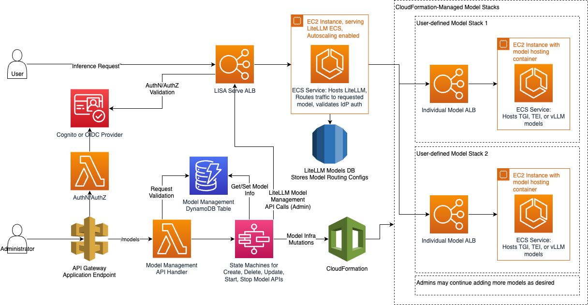
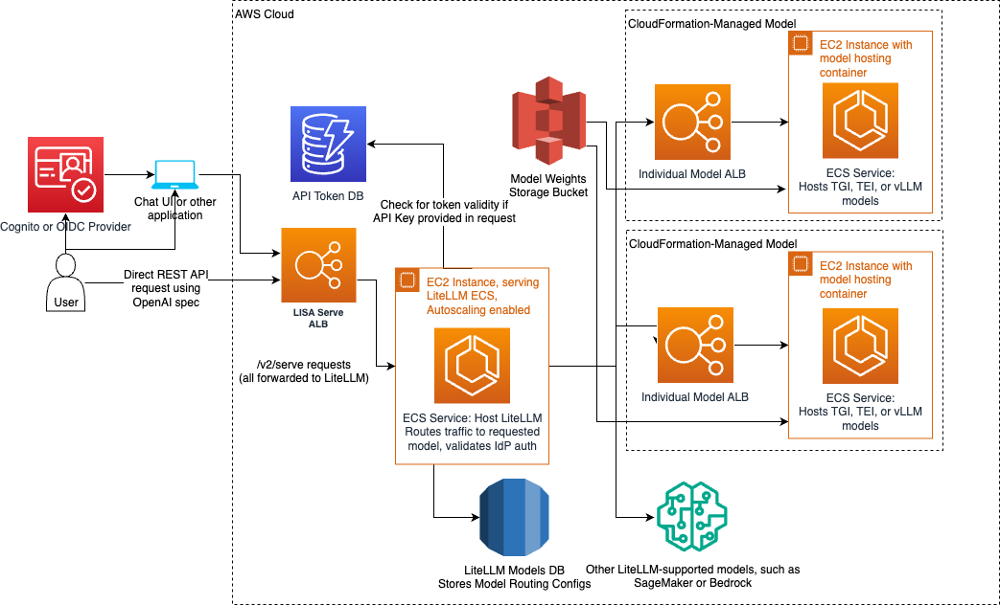
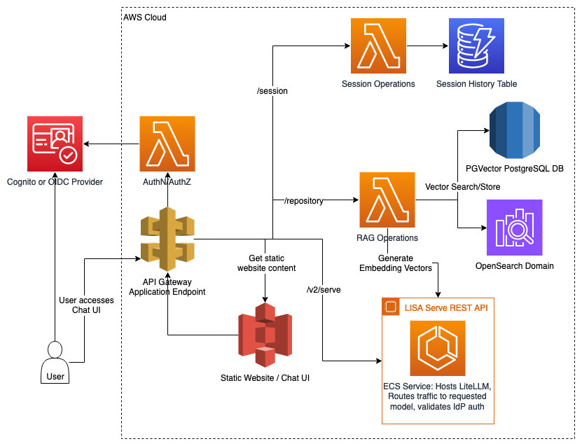

## LISA Components

### LISA Model Management

The Model Management component is responsible for managing the entire lifecycle of models in LISA. This includes creation, updating, deletion, and scaling of models deployed on ECS. The system automates and scales these operations, ensuring that the underlying infrastructure is managed efficiently.

* **Model Hosting**: Models are containerized and deployed on AWS ECS, with each model hosted in its own isolated ECS task. This design allows models to be independently scaled based on demand. Traffic to the models is balanced using Application Load Balancers (ALBs), ensuring that the autoscaling mechanism reacts to load fluctuations in real time, optimizing both performance and availability.
* **External Model Routing**: LISA utilizes the LiteLLM proxy to route traffic to different model providers, no matter their API and payload format. Users may add models from external providers, such as SageMaker or Bedrock, to their system to allow requests to models hosted in those systems and services. LISA will simply add the configuration to LiteLLM without creating any additional supporting infrastructure.
* **Model Lifecycle Management**: AWS Step Functions are used to orchestrate the lifecycle of models, handling the creation, update, and deletion workflows. Each workflow provisions the required resources using CloudFormation templates, which manage infrastructure components like EC2 instances, security groups, and ECS services. The system ensures that the necessary security, networking, and infrastructure components are automatically deployed and configured.
    * The CloudFormation stacks define essential resources using the LISA core VPC configuration, ensuring best practices for security and access across all resources in the environment.
    * DynamoDB stores model metadata, while Amazon S3 securely manages model weights, enabling ECS instances to retrieve the weights dynamically during deployment.

#### Technical Implementation

* **Model Lifecycle**: Lifecycle operations such as creation, update, and deletion are executed by Step Functions and backed by AWS Lambda in ```lambda/models/lambda_functions.py```.
* **CloudFormation**: Infrastructure components are provisioned using CloudFormation templates, as defined in ```ecs_model_deployer/src/lib/lisa_model_stack.ts```.
* **ECS Cluster**: ECS cluster and task definitions are located in ```ecs_model_deployer/src/lib/ecsCluster.ts```, with model containers specified in ```ecs_model_deployer/src/lib/ecs-model.ts```.

---

### LISA Serve

LISA Serve is responsible for processing inference requests and serving model predictions. This component manages user requests to interact with LLMs and ensures that the models deliver low-latency responses.

* **Inference Requests**: Requests are routed via ALB, which serves as the main entry point to LISA’s backend infrastructure. The ALB forwards requests to the appropriate ECS-hosted model or externally-hosted model based on the request parameters. For models hosted within LISA, traffic to the models is managed with model-specific ALBs, which enable autoscaling if the models are under heavy load. LISA supports both direct REST API-based interaction and interaction through the Chat UI, enabling programmatic access or a user-friendly chat experience.
* **RAG (Retrieval-Augmented Generation)**: RAG operations enhance model responses by integrating external data sources. LISA leverages OpenSearch or PGVector (PostgreSQL) as vector stores, enabling vector-based search and retrieval of relevant knowledge to augment LLM outputs dynamically.

#### Technical Implementation

* RAG operations are managed through ```lambda/rag/lambda_functions.py```, which handles embedding generation and document retrieval via OpenSearch and PostgreSQL.
* Direct requests to the LISA Serve ALB entrypoint must utilize the OpenAI API spec, which we support through the use of the LiteLLM proxy.

---

### LISA Chat

LISA Chat provides a customizable chat interface that enables users to interact with models in real-time. This component ensures that users have a seamless experience for submitting queries and maintaining session continuity.

* **Chat Interface**: The Chat UI is hosted as a static website on Amazon S3 and is served via API Gateway. Users can interact with models directly through the web-based frontend, sending queries and viewing real-time responses from the models. The interface is integrated with LISA's backend services for model inference, retrieval augmented generation, and session management.
* **Session History Management**: LISA maintains session histories using DynamoDB, allowing users to retrieve and continue previous conversations seamlessly. This feature is crucial for maintaining continuity in multi-turn conversations with the models.

#### Technical Implementation

* The Chat UI is implemented in the ```lib/user-interface/react/``` folder and is deployed using the scripts in the ```scripts/``` folder.
* Session management logic is handled in ```lambda/session/lambda_functions.py```, where session data is stored and retrieved from DynamoDB.
* RAG operations are defined in lambda/repository/lambda_functions.py

---

## Interaction Flow

1. **User Interaction with Chat UI or API:** Users can interact with LISA through the Chat UI or REST API. Each interaction is authenticated using AWS Cognito or OIDC, ensuring secure access.
1. **Request Routing:** The API Gateway securely routes user requests to the appropriate backend services, whether for fetching the chat UI, performing RAG operations, or managing models.
1. **Model Management:** Administrators can deploy, update, or delete models via the Model Management API, which triggers ECS deployment and scaling workflows.
1. **Model Inference:** Inference requests are routed to ECS-hosted models or external models via the LiteLLM proxy. Responses are served back to users through the ALB.
1. **RAG Integration:** When RAG is enabled, LISA retrieves relevant documents from OpenSearch or PGVector, augmenting the model's response with external knowledge.
1. **Session Continuity:** User session data is stored in DynamoDB, ensuring that users can retrieve and continue previous conversations across multiple interactions.
1. **Autoscaling:** ECS tasks automatically scale based on system load, with ALBs distributing traffic across available instances to ensure performance.
